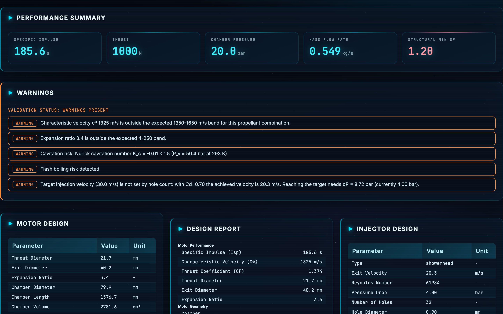
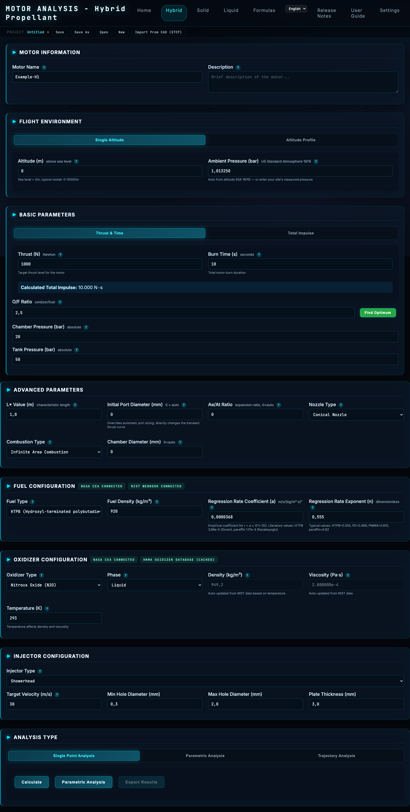
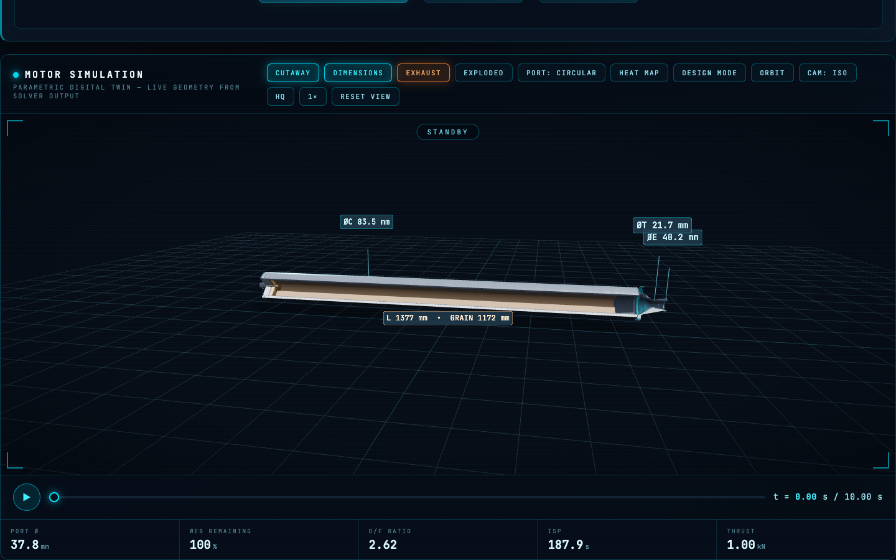
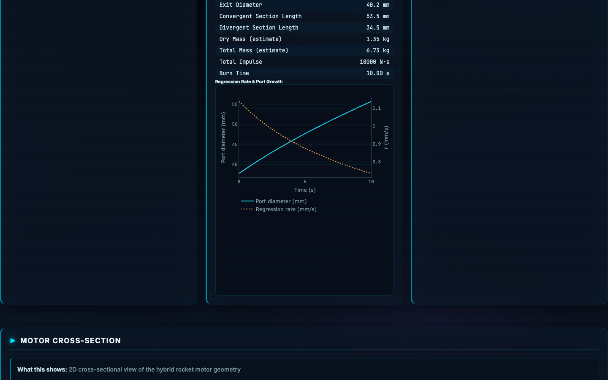
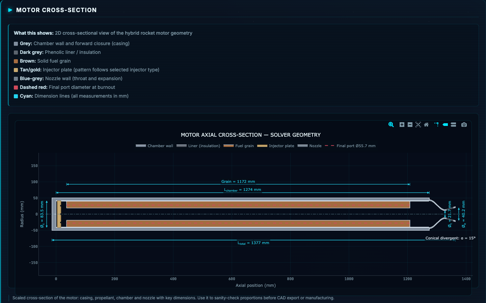

# HRMA - High-Fidelity Rocket Motor Analysis

[](https://github.com/berketez/HRMA/actions/workflows/tests.yml)
[](LICENSE)

A comprehensive desktop tool for designing and analyzing hybrid, solid, and liquid rocket motors. Input your parameters, get optimized motor geometry, performance metrics, and an interactive 3D model of your motor built live from the solver output.



*Solver output for a hybrid motor: performance, geometry and warnings — every
number on this page is computed, and anything that is not computed says so.*

| | |
|---|---|
|  |  |
| **Design input** — three motor families share one form; fields the solver does not use are marked, not silently ignored. | **Interactive 3D model** — built from the solver's own geometry, not a stock illustration. Cutaway, burn animation and exploded view. |
|  |  |
| **Performance charts** — thrust, pressure and O/F histories from the integrated burn. | **Engineering cross-section** — the same contour that drives STEP, DXF and STL export. |


## Just Want to Use HRMA? Download the Installer

**You do not need Python, the source code, or anything on this page.** Grab the
installer for your platform from the
[**latest release**](https://github.com/berketez/HRMA/releases/latest), run it,
and you're done:

| Platform | Direct download |
|---|---|
| **Windows 10/11** | [**HRMA-Setup-2.6.25.exe**](https://github.com/berketez/HRMA/releases/download/v2.6.25/HRMA-Setup-2.6.25.exe) (double-click, then Next → Next → Install) |
| **macOS 11+ (Apple Silicon)** | [**HRMA-Setup-2.6.25-macOS.dmg**](https://github.com/berketez/HRMA/releases/download/v2.6.25/HRMA-Setup-2.6.25-macOS.dmg) (drag HRMA to Applications) |

Everything is bundled (Python, all libraries, offline charts). HRMA opens in
its own native window and notifies you automatically when a new version is
available. All the folders and files below are **source code for developers**;
you can ignore them entirely.

## Features

- **Three Motor Types**: Hybrid (HTPB/N2O, etc.), Solid (APCP, KNSB, etc.), Liquid (RP-1/LOX, LH2/LOX, etc.)
- **Optimal Design Output**: Nozzle angles, grain geometry, injector sizing, wall thickness, all calculated from first principles
- **Interactive 3D Model (Three.js/WebGL)**: Parametric motor visualization built live from solver output: cutaway view, burn animation driven by the computed port regression history, exploded view, dimension labels, and exhaust plume
- **Interactive Design Mode**: Chamber diameter / L* / expansion ratio sliders with ~1 s geometry recompute (`/api/quick-geometry`); 3D model and 2D cross-section update live
- **Grain Port Cross-Sections**: Circular, star, multi-port, and finocyl port shapes (area-equivalent visualization; ballistics solved with the circular-equivalent port)
- **Wall Heat-Flux Map**: Chamber/nozzle surface colored by Bartz-distributed heat flux with real q and T_wall anchors from the heat transfer module
- **Real-Geometry CAD Export**: STL solids revolved from the same nozzle contour used by the solver and the 2D drawing (watertight, single source of truth); injector orifices actually drilled (manifold3d booleans)
- **STEP / DXF / Drawing PDF**: true parametric STEP solids (build123d/OpenCascade), layered DXF manufacturing profiles (ezdxf), and multi-page dimensioned technical-drawing PDFs, plus a one-click complete design package ZIP (STL+STEP+DXF+PDF+.eng+geometry)
- **Transient Ballistics Panel**: time-resolved Pc(t)/F(t) with regulated or self-pressurizing N₂O blowdown feed, SP-8089 injector-stability margins; the OpenRocket `.eng` export uses the real computed thrust curve
- **Full Feature Parity Across Motor Types**: motor design tables, engineering cross-section drawings, working CAD/PDF/.eng exports, trajectory and safety reports on the hybrid, solid **and** liquid pages
- **Solid Motor Monte Carlo**: manufacturing-tolerance uncertainty analysis (burn-rate a/n, density, C*; 300 samples in <1 s) with success rate, statistics and thrust/Isp histograms
- **Uncertainty Quantification (v2.5.0 Confidence Release)**: full-design Monte Carlo with Latin Hypercube sampling, reported as P50 median with a [P5, P95] 90 % credible interval per output, plus a Spearman rank-correlation sensitivity tornado that ranks which input uncertainties drive each result; three explicit effort levels (`fast` / `engineering` / `high_fidelity`, 200 / 1000 / 3000 samples) and a fixed seed for reproducibility (`/api/uncertainty-analysis`, available on the hybrid, solid and liquid pages)
- **Real-Experiment Validation Database (v2.5.0 Confidence Release)**: a git-tracked JSON database of published, fully-cited real firing data (hybrid, solid and liquid static-fire points plus published engine specs and strand burn-rate data) with a hard `inputs`/`measured` separation that structurally prevents circular validation; an automatic correlation report (`/api/correlation-report`, cached by database content hash) scores HRMA predictions against the measurements and writes the summary into VALIDATION_STATUS.md
- **Exact Star Grain Regression**: burning perimeter computed by geometric offset of the true star profile (Huygens principle, validated against the analytic circular-port solution). Point count and depth feed directly into the thrust curve
- **Liquid Engine Flow Schematic**: feed-system diagram (tanks → turbopump/pressure-fed → injector → chamber → nozzle) generated from computed flow rates and pressures
- **6-DOF Flight Panel** (all three motor pages): Barrowman stability (CN_α/CP, static margin), weathercocking and apogee, chained directly onto the computed thrust curve
- **Analysis Deck (13 panels)**: tabbed engineering-analysis deck that pre-fills from the current motor result: Structural Safety (Lamé/SP-8007/fatigue), Thermal Safety (Bartz + axial wall profile), Comprehensive Safety, Advanced Performance (3D surface, Mach contour), Pressure Vessel (MAWP/burst), Thermal Protection (ablative/heat-sink/radiation-cooled), Bolted Joint (Shigley), Nozzle Flow (quasi-1D), User Data Validation (static-fire CSV), Regenerative Cooling (liquid), Feed System (slosh/pressurant/water hammer), Injector Design, and Comparative Analysis
- **Quasi-1D Nozzle Flow**: compressible quasi-1D solver with regime detection, P(x)/M(x) profiles and CF, replacing the former placeholder CFD panel
- **Staged Combustion Kinetics**: three explicit fidelity levels (Fast Screening / Engineering / High-Fidelity finite-rate Cantera integration) with honest `fidelity_used` reporting and graceful fallback when Cantera is absent
- **Materials Database**: 24 engineering materials (steels, aluminium alloys, titanium, Inconel, coppers, refractories, graphite, carbon-carbon, ablative liner) with temperature-derated properties feeding the structural and thermal panels
- **Material Verdicts (v2.6.26)**: the selected nozzle material gets a throat thermal margin (Bartz axial profile at the throat station vs its allowable temperature) and, where a published coefficient band exists, an erosion recession rate and throat growth — tungsten has no published band and is reported as "no published data" rather than given an invented coefficient; the selected injector material sizes the injector plate (stress, safety factor, required thickness, mass) from an edge-fixed circular plate with an ASME ligament efficiency
- **Injector Design Module**: seven element types with the Dyer NHNE two-phase model for self-pressurizing N₂O (not the optimistic single-phase orifice equation)
- **Gas Radiation (Leckner)**: chamber radiation uses Leckner H₂O/CO₂ gas emissivity correlations instead of a black-body assumption
- **Native Desktop App**: opens in its own window (macOS WKWebView / Windows WebView2, no Chrome required), splash screen appears in ~1 s while engines load in the background; closing the window closes the app
- **Automatic Updates**: checks GitHub Releases at startup and offers one-click download & install of new versions
- **Fully Offline**: all JS libraries (Plotly, Three.js, MathJax) are bundled, so there is no CDN dependency and no internet needed after installation
- **NASA CEA Integration**: Real thermochemical data via RocketCEA; hybrid thermochemistry computed by the built-in Cantera equilibrium solver
- **Performance Analysis**: Thrust curves, Isp, trajectory simulation, heat transfer, structural analysis
- **Export**: STL files, OpenRocket .eng files, PDF reports

## Validation

HRMA's thermochemistry is cross-checked against **NASA CEA** (via RocketCEA):
hybrid combustion (c\*, Tc, Isp) agrees within **≤1.5 %** across all supported
fuel/oxidizer pairs, and liquid c\* within **<2 %**. The test suite runs on a
clean machine on every push — see the badge at the top of this page for the
current count and result.

**How to read the liquid-engine numbers (v2.6.2).** Across fourteen published
engine operating points from six countries, the median absolute error in vacuum
specific impulse is about 1.2 % (bias +0.9 %). That figure supports one specific
claim and no more: *given the real operating point (chamber pressure, mixture
ratio) and the real published expansion ratio, HRMA reproduces the published
specific impulse.* It does not demonstrate accuracy when the nozzle geometry is
not yet known, which is the situation in actual preliminary design. Three
caveats are stated explicitly rather than buried:

- **The sample is still small (n = 14)** and the engines are not a random or
  representative sample. No claim about typical accuracy, error distribution,
  variance, or any sigma-level reliability can be made from it. A
  distribution-free demonstration that 99.73 % of results stay inside an error
  bound, at 95 % confidence, would require on the order of a thousand
  independent samples; establishing a defensible error distribution first
  would reduce that to a few dozen. Growing this database is ongoing work.
- **The worst single case is a missing-geometry assumption, not model error.**
  The largest miss in the set (Vulcain 2.1) has no published expansion ratio in
  the record, so the model designs its own ambient-matched nozzle and
  under-predicts vacuum Isp by about 4 %; engines whose published expansion
  ratio is in the record do markedly better.
- Where a *measured* quantity is consumed as a solver input, the corresponding
  "prediction" is labelled as a consistency check rather than independent
  evidence in the correlation output.

The exact, always-current per-quantity figures (including the hybrid regression
rate, chamber pressure and Isp errors, which remain much larger) are
machine-generated — see the `AUTO-CORRELATION` block in
[VALIDATION_STATUS.md](docs/VALIDATION_STATUS.md), never hand-edited numbers
here.

As of the **v2.5.0 Confidence Release**, HRMA also carries a git-tracked
database of real, fully-cited firing data (hybrid, solid and liquid), and an
automated correlation runner scores the predictions against it. The current
correlation statistics (bias, median absolute percent error, RMS, per-quantity
sample counts and worst-case tests) are machine-generated and change with every
run, so they are **not duplicated here**. See the auto-generated correlation
block in [VALIDATION_STATUS.md](docs/VALIDATION_STATUS.md) (the section "Automated
correlation snapshot", between the `AUTO-CORRELATION` markers) for the live
numbers. The signed-error convention there is `(predicted − measured) / measured
× 100`; outliers are flagged but never dropped, and anomaly-flagged records are
aggregated separately from the main statistics.

HRMA is a **preliminary-design and educational tool**, not a flight-qualification
tool. Predicted performance should be cross-checked against an independent code
(CEA / RPA / openMotor) and verified by physical testing before firing any motor.
See [VALIDATION_STATUS.md](docs/VALIDATION_STATUS.md) for full verification results,
uncertainty bands, and known limitations.

## Installation (No Python Required)

One-click installers with Python 3.12 and **all** dependencies embedded. No
internet connection, no admin rights, and no terminal needed:

Download the latest installers from the
[**Releases page**](https://github.com/berketez/HRMA/releases/latest):

| Platform | Installer | Notes |
|---|---|---|
| **Windows 10/11** | [`HRMA-Setup-2.6.25.exe`](https://github.com/berketez/HRMA/releases/download/v2.6.25/HRMA-Setup-2.6.25.exe) | English setup wizard (Next → Next → Install); per-user, desktop shortcut, no admin rights |
| **macOS 11+ (Apple Silicon)** | [`HRMA-Setup-2.6.25-macOS.dmg`](https://github.com/berketez/HRMA/releases/download/v2.6.25/HRMA-Setup-2.6.25-macOS.dmg) | Drag & drop to Applications; right-click → Open on first launch |

Once installed, HRMA notifies you at startup when a new version is released
and updates itself with one click.

The installers are unsigned: Windows SmartScreen shows "More info → Run anyway",
macOS Gatekeeper needs right-click → Open once. CAD and drawing outputs are
written to `Documents/HRMA`. Build pipeline and reproduction instructions:
[`packaging/`](packaging/README.md).

## Quick Start (Developers)

```bash
git clone https://github.com/berketez/HRMA.git
cd HRMA
pip install -r requirements.txt
python hrma/run.py
```

Open http://localhost:8080 in your browser.

## Project Structure

```
HRMA/
├── start.sh / start.bat    # Developer launch scripts
├── hrma/                   # Main package
│   ├── app.py              # Flask web application (~73 routes)
│   ├── run.py              # Launcher (waitress on port 8080)
│   ├── constants.py        # Shared physical constants & parameters
│   ├── engines/            # Motor calculations
│   │   ├── hybrid_rocket_engine.py
│   │   ├── solid_rocket_engine.py
│   │   ├── liquid_rocket_engine.py
│   │   ├── combustion_analysis.py
│   │   ├── injector_design.py      # 7 element types, Dyer NHNE two-phase
│   │   └── nozzle_design.py
│   ├── analysis/           # Engineering analysis
│   │   ├── nozzle_flow_1d.py       # Quasi-1D compressible nozzle flow
│   │   ├── kinetic_efficiency.py   # Fast / Engineering / High-Fidelity kinetics
│   │   ├── heat_transfer_analysis.py
│   │   ├── structural_analysis.py
│   │   ├── pressure_vessel.py
│   │   ├── thermal_protection.py
│   │   ├── bolted_joint.py
│   │   ├── regen_cooling.py
│   │   ├── slosh_analysis.py / pressurant_sizing.py / water_hammer.py
│   │   ├── transient_ballistics.py / tank_blowdown.py
│   │   ├── six_dof_trajectory.py / trajectory_analysis.py
│   │   ├── safety_analysis.py / safety_limits.py
│   │   └── ...
│   ├── data/               # Data sources & databases
│   │   ├── propellant_database.py
│   │   ├── materials_db.py         # 11 engineering materials
│   │   ├── chemical_database.py
│   │   └── ...
│   ├── export/             # Output generation
│   │   ├── cad_export.py / step_export.py
│   │   ├── drawing_generator.py / motor_geometry.py
│   │   ├── openrocket_integration.py
│   │   └── pdf_generator.py
│   ├── validation/         # Verification & validation
│   ├── visualization/      # Plotly charts & dashboards
│   ├── utils/              # Helpers, update checker, job runner
│   ├── templates/          # HTML templates (index, hybrid, solid, liquid, formulas)
│   └── static/             # Dark theme CSS + JS (Three.js viz, Analysis Deck panels)
├── data/                   # Runtime databases & cache
├── packaging/              # Installer build scripts (dmg / exe) & release tooling
├── tests/                  # Test suite (1,000+ automated tests)
└── docs/                   # Documentation
```

## Requirements

- Python 3.10–3.13 (**3.12 recommended**; 3.14 not supported yet, because its compiled dependencies lack wheels)
- Flask, NumPy, SciPy, Plotly, Matplotlib
- RocketCEA (NASA CEA wrapper)
- CoolProp (thermodynamic properties)
- See `requirements.txt` for full list

## How It Works

1. **Input**: Enter motor parameters (thrust, chamber pressure, fuel type, O/F ratio, etc.)
2. **Calculate**: Engine computes optimal geometry using isentropic flow relations, Saint-Robert burn rate law, and NASA CEA thermochemistry
3. **Output**: Get a complete design package:
   - Nozzle dimensions and angles (convergent/divergent)
   - Grain geometry (web thickness, segments, Kn range)
   - Injector sizing (orifice diameter, pressure drop)
   - Performance metrics (Isp, c*, CF, thrust curve)
   - Interactive 3D model (cutaway, burn animation, heat map)
   - Exportable STL/CAD files generated from the real solver geometry

## Version

**HRMA v2.6.25**
- Developed by: Berke Tezgocen
- Idea & Testing: Ayberk Cem Aksoy
- A preliminary-design and educational rocket-propulsion analysis tool
  (not a flight-qualification tool — see the scope note above)
- Last Updated: July 2026

**v2.6.26 is a wiring release.** It adds no physics. An empirical audit of the
hybrid page measured, field by field, whether typing a value into an input
changed any leaf of the output. Eight fields changed nothing at all, and the
release connects them:

- **`Safety Factor`** now sets the structural module's design target — and,
  because the real wall thickness is passed with it, the module switches from
  *sizing* to *verification*. That matters more than the field itself: in
  sizing mode the reported factor is by construction `target × manufacturing
  allowance`, i.e. your own input read back to you. It is now computed from
  pressure, diameter, material and thickness, so it reports a different (and
  measured) number than earlier releases did for the same design.
- **`Chamber Length Override`** overrides the L\*-derived chamber length, and
  is *rejected with a stated reason* when the grain plus pre-combustion
  chamber would not fit — not silently trimmed to something you did not ask
  for.
- **`Nozzle Material`** drives a throat thermal margin (Bartz axial profile
  solved at the throat with that material against its allowable temperature)
  and an erosion estimate. Graphite and carbon-carbon have published
  coefficient bands and get numbers; **tungsten does not, so no coefficient is
  invented — the result says "no published data".** Copper is labelled
  "regeneratively cooled" in the interface and is solved on that declared
  assumption.
- **`Injector Material`** sizes the injector plate: bending stress, safety
  factor, required thickness and mass, from an edge-fixed circular plate
  (Roark's Formulas Table 11.2, case 10b) with an ASME BPVC PG-52 ligament
  efficiency for the drilled area.
- **`Swirl Chamber Diameter`** and **`Tangential Entry Angle`** enter the
  Giffen-Muraszew pressure-swirl solution (`K = A_p/(D_s·d_o)`, with the angle
  as the target spray half-angle driving the inverse solver). The inverse
  solver was already in the repository; the fields simply were not attached
  to it.
- **`Combustion Type` (finite area)** and **`Contraction Ratio`** now solve
  the subsonic root of the isentropic area relation for the chamber Mach
  number and report the injector-face over-pressure that follows.

Two fields were **removed** because each was a second, unwired copy of a
concept that already had a working field: `Nozzle Contour` (its parabolic
option moved into `Nozzle Type`, which the solver reads) and `Injection
Velocity` (wired equivalent: `Target Velocity` in the showerhead panel — and
the old field was overwritten with the solver's own exit velocity after every
run, so the input was replaced by the result).

Two shipped bugs were fixed:

- Selecting an impingement injector and leaving the impingement angle empty
  crashed `/calculate` with `HTTP 500` (a constant was used but never
  imported).
- When the injector circuit model could not size the selected element type,
  the result was filled with **12-hole showerhead constants and labelled with
  the type the user had chosen** — a fabricated hole plan someone could take
  to a machine shop. It now returns `status: not_analyzed` with the reason,
  and the warning reaches the screen instead of the server log.

Also in this release: the hybrid engine's design warnings now actually reach
the warnings panel (they were collected and discarded, so silent material
fallbacks stayed silent); archive entry names and spreadsheet cells are
sanitised on export (ZIP-Slip and CSV/XLSX formula injection); the local API's
Host gate applies to `GET`/`HEAD`/`OPTIONS` as well, closing a DNS-rebinding
read path; and the chemical database no longer writes to disk at import time,
so a read-only installation starts.

**v2.6.25 is a field fix.** v2.6.2 shipped with a red CI run and was unusable
on a real machine: a fixed CORS origin list recognised only port 8080, while
the desktop launcher scans 8080–8090 for a free port. Whenever anything else
held 8080, the application's own page was rejected by its own API with
`HTTP 403` and no engine type would calculate. No test caught it because the
test sent the same hard-coded port the code expected — it confirmed the code's
assumption instead of measuring it. The origin filter now requires a loopback
origin on any port; a regression test walks every port the launcher can pick;
and `packaging/release_gate.sh` refuses to publish unless the full suite is
green, CI is green **for that commit**, and a live server on a **non-default
port** completes a hybrid, solid and liquid calculation over HTTP. The same
release also fixes the macOS dock icon on Tahoe, makes update notes follow the
interface language, and adds Turkish and English text for 42 engine warnings
that previously reached the user as raw codes.

**v2.6.2 was the audit release.** Two independent reviews — an external source
audit and a line-by-line physics audit of every equation in the code —
produced over 300 findings. Rather than list features, here is what the audit
found and what changed, because that is the more useful thing to know about a
tool you are about to trust with a number:

- **A swirl-injector coefficient was inverted.** The largest spray half-angle
  the code could produce was 15.9°; real pressure-swirl atomisers routinely
  reach 30–60°, and orifice area came out 1.7–2.7× oversized.
- **The chamber-wall safety factor was tautological.** Sizing and verification
  used the same allowable, so the reported factor was always
  `safety_factor × 1.2` — identical at 5, 20 and 50 bar. Sizing and
  verification are now separate modes.
- **A tank STEP export applied its 1000× unit conversion twice**, so a 300 mm
  tank was built as 300 metres and the CAD kernel silently returned an empty
  solid.
- **`NaN` and `∞` were converted to `0.0` and `1e10`** on the way out, so a
  diverged solver looked like a real measurement. They are now `null` and
  render as a dash.
- **Regulatory-compliance fields returned an unconditional `True`** and were
  drawn as green "OK" badges regardless of motor or propellant. Removed — the
  software does not evaluate compliance and now says so.

The full list, with the measured numerical effect of each finding, is in
[`docs/v262_specs/PHYSICS_AUDIT.md`](docs/v262_specs/PHYSICS_AUDIT.md).
A machine-checked release gate ([`tests/test_v262_release_gate.py`](tests/test_v262_release_gate.py))
now asserts that each of these fixes is still in place and that every declared
feature is actually reachable from the UI — the recurring failure mode in this
codebase has been modules that were written but never wired up.

Underneath that: real-operating-point liquid thermochemistry via RocketCEA, a
cycle power-balance solver (pressure-fed, gas-generator, tap-off, staged
combustion, FFSC, expander), supercritical regenerative cooling, a
real-experiment validation database with an automatic correlation report and
baseline guard tests, Monte Carlo uncertainty quantification, a 13-panel
Analysis Deck, quasi-1D nozzle flow, staged-combustion kinetics, Leckner
gas-emissivity radiation, NHNE injector design, a 3D launch site that flies
the motor you just designed over NASA satellite imagery, and a native desktop
window with automatic updates.

## Ready to Design?

1. **Clone the repo**
2. **Install dependencies**: `pip install -r requirements.txt`
3. **Run**: `python hrma/run.py`
4. **Open**: `http://localhost:8080`
5. **Start designing rockets!**

## License

MIT — see [LICENSE](LICENSE).

## Tests

The test suite lives in `tests/` and runs on every push via
[GitHub Actions](.github/workflows/tests.yml):

```bash
pip install -r requirements.txt
MPLBACKEND=Agg PYTHONPATH=. pytest tests/ -q
```

Test counts quoted in release notes can therefore be reproduced independently.
