# 🚀 HRMA Motor Types and Analysis
## Comprehensive Analysis of Solid, Liquid, and Hybrid Rocket Motors

> **🎯 "Each motor type has unique physics, but common principles govern all rocket propulsion"**

---

## 📖 TABLE OF CONTENTS

1. [Motor Classification Overview](#motor-classification-overview)
2. [Solid Rocket Motors](#solid-rocket-motors)
3. [Liquid Rocket Engines](#liquid-rocket-engines)
4. [Hybrid Rocket Motors](#hybrid-rocket-motors)
5. [Comparative Analysis](#comparative-analysis)
6. [Performance Trade-offs](#performance-trade-offs)
7. [Design Optimization](#design-optimization)
8. [Real-World Examples](#real-world-examples)
9. [Future Technologies](#future-technologies)
10. [Selection Guidelines](#selection-guidelines)

---

## 🏗️ MOTOR CLASSIFICATION OVERVIEW

### **Fundamental Classification**

Rocket motors are classified based on the **physical state of propellants**:

```mermaid
graph TB
    subgraph "Rocket Motors"
        SOLID[Solid Motors]
        LIQUID[Liquid Engines]
        HYBRID[Hybrid Motors]
    end
    
    subgraph "Solid Characteristics"
        S1[Both propellants solid]
        S2[Simple design]
        S3[High thrust-to-weight]
        S4[No throttling]
    end
    
    subgraph "Liquid Characteristics"
        L1[Both propellants liquid]
        L2[Complex systems]
        L3[High performance]
        L4[Throttleable]
    end
    
    subgraph "Hybrid Characteristics"
        H1[Solid fuel + Liquid oxidizer]
        H2[Moderate complexity]
        H3[Good performance]
        H4[Throttleable/Restartable]
    end
    
    SOLID --> S1
    SOLID --> S2
    SOLID --> S3
    SOLID --> S4
    
    LIQUID --> L1
    LIQUID --> L2
    LIQUID --> L3
    LIQUID --> L4
    
    HYBRID --> H1
    HYBRID --> H2
    HYBRID --> H3
    HYBRID --> H4
```



### **Key Performance Metrics**

| Metric | Solid | Liquid | Hybrid | Units |
|--------|-------|---------|---------|-------|
| **Specific Impulse (Vacuum)** | 250-290 | 350-460 | 300-360 | s |
| **Thrust-to-Weight Ratio** | 40-100 | 40-80 | 20-60 | - |
| **Combustion Efficiency** | 92-98% | 85-99% | 85-95% | % |
| **Throttling Capability** | None | 20-100% | 30-100% | % |
| **Restart Capability** | No | Yes | Yes | - |
| **Storage Life** | 10-20 years | Days-Months | Years | - |

### **HRMA Implementation Overview**

Each motor type is implemented as a separate analysis engine:

```python
class MotorTypeFactory:
    """Factory for creating motor analysis engines"""
    
    @staticmethod
    def create_engine(motor_type: str):
        """Create appropriate motor analysis engine"""
        
        engines = {
            'solid': SolidRocketEngine,
            'liquid': LiquidRocketEngine,
            'hybrid': HybridRocketEngine
        }
        
        if motor_type not in engines:
            raise ValueError(f"Unknown motor type: {motor_type}")
        
        return engines[motor_type]()

# Usage example
def analyze_motor(motor_type, parameters):
    """Universal motor analysis interface"""
    
    engine = MotorTypeFactory.create_engine(motor_type)
    results = engine.analyze(parameters)
    
    # Add NASA validation
    validator = NASARealtimeValidator()
    validation = validator.validate_results(results, parameters)
    
    return {
        'analysis_results': results,
        'validation': validation,
        'motor_type': motor_type
    }
```

---

## 🧨 SOLID ROCKET MOTORS

### **1. Physical Principles**

#### **Combustion Process**
Solid rocket motors burn **premixed propellant grains** where fuel and oxidizer are intimately mixed:

```
Propellant → Hot gases → Nozzle expansion → Thrust
```

#### **Key Characteristics**
- **Simplicity**: No moving parts, no feed systems
- **Reliability**: High success rate (>99%)
- **Thrust profile**: Determined by grain geometry
- **Non-throttleable**: Burn rate primarily pressure-dependent

### **2. Propellant Types**

#### **Ammonium Perchlorate Composite Propellant (APCP)**
Most common modern solid propellant:

**Composition:**
- **Ammonium Perchlorate (AP)**: 60-70% (oxidizer)
- **Aluminum powder**: 15-20% (fuel/energy additive)
- **Polymer binder (HTPB)**: 12-18% (fuel/structural matrix)
- **Additives**: 1-3% (burn rate modifiers, stabilizers)

**Chemical Reaction (Simplified):**
```
6NH₄ClO₄ + 10Al + 3(C₄H₆)ₙ → 3Al₂O₃ + 9H₂O + 3N₂ + 6HCl + 12CO₂ + Energy
```

#### **HRMA Propellant Database**
```python
SOLID_PROPELLANTS = {
    'apcp_standard': {
        'name': 'APCP Standard',
        'composition': {
            'ammonium_perchlorate': 0.68,  # Mass fraction
            'aluminum': 0.18,
            'htpb_binder': 0.13,
            'additives': 0.01
        },
        'properties': {
            'density': 1800,              # kg/m³
            'characteristic_velocity': 1520,  # m/s (effective)
            'burn_rate_coefficient': 5.0e-8,  # m/s/Pa^n
            'pressure_exponent': 0.35,    # -
            'temperature_sensitivity': 0.002,  # 1/K
            'flame_temperature': 3200,    # K
            'molecular_weight': 25.5,     # kg/kmol
            'gamma': 1.25                 # -
        }
    },
    
    'black_powder': {
        'name': 'Black Powder (Historical)',
        'composition': {
            'potassium_nitrate': 0.75,
            'charcoal': 0.15,
            'sulfur': 0.10
        },
        'properties': {
            'density': 1700,
            'characteristic_velocity': 850,
            'burn_rate_coefficient': 2.0e-7,
            'pressure_exponent': 0.8,
            'temperature_sensitivity': 0.005,
            'flame_temperature': 2100,
            'molecular_weight': 35.0,
            'gamma': 1.3
        }
    }
}
```

### **3. Grain Geometry Analysis**

#### **BATES Grain (Basic)**
Cylindrical grain with central circular port:

**Geometric Relations:**
```python
def analyze_bates_grain(outer_radius, initial_port_radius, length, 
                       web_thickness, propellant_properties):
    """
    Complete BATES grain analysis
    
    Args:
        outer_radius (float): Grain outer radius [m]
        initial_port_radius (float): Initial port radius [m]
        length (float): Grain length [m]
        web_thickness (float): Web thickness [m]
        propellant_properties (dict): Propellant characteristics
        
    Returns:
        dict: Complete grain analysis
    """
    
    import math
    import numpy as np
    
    # Initial conditions
    web_remaining = web_thickness
    current_port_radius = initial_port_radius
    
    # Grain analysis results
    results = {
        'geometry': {
            'initial_port_radius': initial_port_radius,
            'outer_radius': outer_radius,
            'length': length,
            'initial_web_thickness': web_thickness
        },
        'mass_properties': {},
        'burning_characteristics': {},
        'performance_prediction': {}
    }
    
    # Mass calculations
    grain_volume = math.pi * (outer_radius**2 - initial_port_radius**2) * length
    propellant_mass = grain_volume * propellant_properties['density']
    
    results['mass_properties'] = {
        'grain_volume': grain_volume,
        'propellant_mass': propellant_mass,
        'loading_density': propellant_mass / (math.pi * outer_radius**2 * length)
    }
    
    # Burning surface area evolution
    def burning_surface_area(port_radius):
        """Calculate burning surface area for given port radius"""
        return 2 * math.pi * port_radius * length
    
    # Web burn analysis
    time_points = np.linspace(0, 30, 300)  # 30 second max burn
    port_radius_history = []
    burn_area_history = []
    mass_flow_history = []
    
    for t in time_points:
        # Simplified constant pressure assumption
        chamber_pressure = 5e6  # Pa (would be coupled in real analysis)
        
        # Burn rate calculation
        burn_rate = calculate_solid_burn_rate(
            chamber_pressure, 298.15, propellant_properties
        )
        
        # Update port radius
        current_port_radius = initial_port_radius + burn_rate * t
        
        # Check for burnout
        if current_port_radius >= outer_radius:
            current_port_radius = outer_radius
            break
        
        # Calculate current burning characteristics
        burn_area = burning_surface_area(current_port_radius)
        mass_flow_rate = propellant_properties['density'] * burn_rate * burn_area
        
        port_radius_history.append(current_port_radius)
        burn_area_history.append(burn_area)
        mass_flow_history.append(mass_flow_rate)
    
    # Store time-dependent results
    actual_burn_time = time_points[len(port_radius_history)]
    
    results['burning_characteristics'] = {
        'burn_time': actual_burn_time,
        'port_radius_evolution': port_radius_history,
        'burn_area_evolution': burn_area_history,
        'mass_flow_evolution': mass_flow_history,
        'average_burn_rate': (outer_radius - initial_port_radius) / actual_burn_time
    }
    
    return results

def calculate_solid_burn_rate(pressure, temperature, propellant_props):
    """Calculate burn rate using Vieille's law with temperature correction"""
    
    import math
    
    # Base burn rate (Vieille's law)
    a = propellant_props['burn_rate_coefficient']
    n = propellant_props['pressure_exponent']
    base_rate = a * (pressure ** n)
    
    # Temperature sensitivity correction
    sigma_p = propellant_props['temperature_sensitivity']
    T_ref = 298.15  # Reference temperature (25°C)
    temp_factor = math.exp(sigma_p * (temperature - T_ref))
    
    return base_rate * temp_factor
```

#### **Star Grain Geometry**
Star-shaped grains provide different thrust profiles:

```python
def analyze_star_grain(outer_radius, star_points, star_inner_radius, 
                      star_outer_radius, length, propellant_properties):
    """
    Analyze star grain geometry and burning characteristics
    
    Args:
        outer_radius (float): Grain case inner radius [m]
        star_points (int): Number of star points
        star_inner_radius (float): Star inner radius [m]
        star_outer_radius (float): Star outer radius [m]
        length (float): Grain length [m]
        propellant_properties (dict): Propellant characteristics
        
    Returns:
        dict: Star grain analysis
    """
    
    import math
    import numpy as np
    
    # Star geometry calculations
    theta_point = 2 * math.pi / star_points  # Angle per point
    
    def star_perimeter(inner_r, outer_r, n_points):
        """Calculate perimeter of star shape"""
        # Simplified calculation - actual implementation would use
        # more complex geometry
        point_length = math.sqrt((outer_r - inner_r)**2 + 
                               (outer_r * math.sin(theta_point/2))**2)
        return n_points * 2 * point_length
    
    def star_area(inner_r, outer_r, n_points):
        """Calculate cross-sectional area of star"""
        # Area of outer circle minus star inner area
        outer_area = math.pi * outer_r**2
        # Approximate inner star area
        inner_star_area = n_points * 0.5 * inner_r**2 * math.sin(theta_point)
        return outer_area - inner_star_area
    
    # Initial burning surface area
    initial_perimeter = star_perimeter(star_inner_radius, star_outer_radius, star_points)
    initial_burn_area = initial_perimeter * length
    
    # Star grain provides progressive-regressive burning
    # Initially progressive (increasing burn area) then regressive
    
    results = {
        'geometry': {
            'star_points': star_points,
            'initial_perimeter': initial_perimeter,
            'initial_burn_area': initial_burn_area
        },
        'burning_profile': 'progressive-regressive',
        'advantages': [
            'Extended high thrust period',
            'Smooth thrust transition',
            'High volumetric loading'
        ]
    }
    
    return results
```

### **4. Performance Prediction**

#### **Chamber Pressure Evolution**
For solid motors, chamber pressure is determined by equilibrium between propellant gas generation and nozzle flow:

```python
def predict_solid_motor_performance(grain_analysis, nozzle_geometry, 
                                  ambient_conditions):
    """
    Predict solid motor performance over burn time
    
    Args:
        grain_analysis (dict): Results from grain geometry analysis
        nozzle_geometry (dict): Nozzle design parameters
        ambient_conditions (dict): Operating environment
        
    Returns:
        dict: Performance prediction
    """
    
    import math
    import numpy as np
    
    # Extract parameters
    burn_area_evolution = grain_analysis['burning_characteristics']['burn_area_evolution']
    propellant_density = grain_analysis['propellant_properties']['density']
    c_star = grain_analysis['propellant_properties']['characteristic_velocity']
    gamma = grain_analysis['propellant_properties']['gamma']
    
    throat_area = nozzle_geometry['throat_area']
    expansion_ratio = nozzle_geometry['expansion_ratio']
    ambient_pressure = ambient_conditions['pressure']
    
    # Performance arrays
    n_points = len(burn_area_evolution)
    chamber_pressure = np.zeros(n_points)
    mass_flow_rate = np.zeros(n_points)
    thrust = np.zeros(n_points)
    specific_impulse = np.zeros(n_points)
    
    for i, burn_area in enumerate(burn_area_evolution):
        # Solve for chamber pressure iteratively
        # Gas generation rate = Nozzle flow rate
        
        def pressure_balance(Pc):
            """Pressure balance equation for chamber pressure"""
            
            # Gas generation rate
            burn_rate = calculate_solid_burn_rate(Pc, 298.15, 
                                               grain_analysis['propellant_properties'])
            gas_generation = propellant_density * burn_rate * burn_area
            
            # Nozzle flow rate
            nozzle_flow = (Pc * throat_area) / c_star
            
            return gas_generation - nozzle_flow
        
        # Solve for chamber pressure
        try:
            from scipy.optimize import fsolve
            Pc_solution = fsolve(pressure_balance, 5e6)[0]  # Initial guess 50 bar
        except:
            # Fallback analytical approximation
            Pc_solution = 5e6  # Constant pressure assumption
        
        chamber_pressure[i] = Pc_solution
        mass_flow_rate[i] = (Pc_solution * throat_area) / c_star
        
        # Thrust calculation
        exit_pressure = calculate_exit_pressure(Pc_solution, expansion_ratio, gamma)
        exit_velocity = calculate_exit_velocity(Pc_solution, exit_pressure, gamma, c_star)
        
        momentum_thrust = mass_flow_rate[i] * exit_velocity
        pressure_thrust = (exit_pressure - ambient_pressure) * throat_area * expansion_ratio
        thrust[i] = momentum_thrust + pressure_thrust
        
        # Specific impulse
        specific_impulse[i] = thrust[i] / (mass_flow_rate[i] * 9.80665)
    
    # Calculate total impulse
    time_array = np.linspace(0, grain_analysis['burning_characteristics']['burn_time'], n_points)
    total_impulse = np.trapz(thrust, time_array)
    
    return {
        'time': time_array,
        'chamber_pressure': chamber_pressure,
        'mass_flow_rate': mass_flow_rate,
        'thrust': thrust,
        'specific_impulse': specific_impulse,
        'performance_summary': {
            'max_thrust': np.max(thrust),
            'average_thrust': np.mean(thrust),
            'total_impulse': total_impulse,
            'average_isp': np.mean(specific_impulse),
            'burn_time': grain_analysis['burning_characteristics']['burn_time']
        }
    }
```

### **5. Real-World Solid Motor Examples**

#### **Space Shuttle SRB**
```python
SHUTTLE_SRB_SPECS = {
    'name': 'Space Shuttle Solid Rocket Booster',
    'manufacturer': 'Thiokol/Northrop Grumman',
    'applications': ['Space Shuttle', 'SLS (modified)'],
    
    'geometry': {
        'length': 45.46,              # m
        'diameter': 3.71,             # m
        'propellant_mass': 503000,    # kg
        'grain_type': 'star',
        'segments': 4
    },
    
    'performance': {
        'thrust_sea_level': 12450000, # N
        'thrust_vacuum': 13800000,    # N
        'specific_impulse_sea_level': 242,  # s
        'specific_impulse_vacuum': 268,     # s
        'burn_time': 124,             # s
        'total_impulse': 1.54e9       # N⋅s
    },
    
    'propellant': {
        'type': 'APCP',
        'ap_content': 0.698,          # Mass fraction
        'aluminum_content': 0.16,
        'binder_content': 0.126,
        'other_content': 0.016
    }
}
```

#### **Ariane 5 P241 Booster**
```python
ARIANE5_P241_SPECS = {
    'name': 'Ariane 5 P241 Solid Booster',
    'manufacturer': 'Europropulsion',
    
    'geometry': {
        'length': 31.6,              # m
        'diameter': 3.05,            # m
        'propellant_mass': 240000,   # kg
        'grain_type': 'segmented_star'
    },
    
    'performance': {
        'thrust_sea_level': 6500000, # N
        'specific_impulse_sea_level': 274.5,  # s
        'burn_time': 130,            # s
        'total_impulse': 6.4e8       # N⋅s
    }
}
```

---

## 🌊 LIQUID ROCKET ENGINES

### **1. Physical Principles**

#### **Combustion Process**
Liquid rocket engines mix **separate liquid propellants** in a combustion chamber:

```
Fuel tank → Feed system → Injector ↘
                                    → Combustion → Nozzle → Thrust
Oxidizer tank → Feed system → Injector ↗
```

#### **Key Advantages**
- **High specific impulse**: Best performance (350-460s)
- **Throttleability**: Variable thrust control
- **Restartability**: Multiple ignition cycles
- **Precise control**: Accurate trajectory correction

#### **Key Challenges**
- **Complexity**: Thousands of components
- **Cost**: Expensive development and manufacturing
- **Reliability**: More failure modes than solid motors
- **Storage**: Limited propellant storage life

### **2. Propellant Combinations**

#### **Cryogenic Propellants**

**LH2/LOX (Hydrogen/Oxygen):**
```python
LH2_LOX_PROPERTIES = {
    'propellants': {
        'fuel': 'Liquid Hydrogen (LH2)',
        'oxidizer': 'Liquid Oxygen (LOX)',
        'mixture_ratio_optimal': 6.0,  # kg LOX / kg LH2
        'mixture_ratio_range': [4.5, 8.0]
    },
    
    'thermodynamic': {
        'combustion_temperature': 3357,    # K
        'molecular_weight_products': 15.96, # kg/kmol
        'gamma': 1.24,                     # -
        'characteristic_velocity_theoretical': 2356.7,  # m/s (CEA)
        'characteristic_velocity_effective': 1580.0,    # m/s (RS-25 actual)
        'combustion_efficiency': 0.67      # Effective/Theoretical
    },
    
    'performance': {
        'specific_impulse_vacuum': 452,    # s
        'specific_impulse_sea_level': 366, # s
        'density_impulse': 315,           # s⋅g/cm³
        'bulk_density': 386               # kg/m³ (mixed)
    },
    
    'storage': {
        'fuel_temperature': 20.3,         # K (-252.85°C)
        'oxidizer_temperature': 90.2,     # K (-182.95°C)
        'fuel_density': 70.85,            # kg/m³
        'oxidizer_density': 1141.7,       # kg/m³
        'boiloff_rate_fuel': 0.5,         # %/day
        'boiloff_rate_oxidizer': 0.1      # %/day
    },
    
    'applications': ['Upper stages', 'Deep space', 'Heavy lift cores'],
    'examples': ['RS-25 (Shuttle)', 'RL-10 (Centaur)', 'Vulcain (Ariane)']
}
```

**RP-1/LOX (Kerosene/Oxygen):**
```python
RP1_LOX_PROPERTIES = {
    'propellants': {
        'fuel': 'RP-1 (Refined Petroleum-1)',
        'oxidizer': 'Liquid Oxygen (LOX)',
        'mixture_ratio_optimal': 2.56,    # kg LOX / kg RP-1
        'mixture_ratio_range': [2.0, 3.5]
    },
    
    'thermodynamic': {
        'combustion_temperature': 3670,    # K
        'molecular_weight_products': 22.86, # kg/kmol
        'gamma': 1.22,                     # -
        'characteristic_velocity_theoretical': 1823.4,  # m/s (CEA)
        'characteristic_velocity_effective': 1715.0,    # m/s (F-1 actual)
        'combustion_efficiency': 0.94      # Effective/Theoretical
    },
    
    'performance': {
        'specific_impulse_vacuum': 353,    # s
        'specific_impulse_sea_level': 312, # s
        'density_impulse': 368,           # s⋅g/cm³
        'bulk_density': 1030              # kg/m³ (mixed)
    },
    
    'storage': {
        'fuel_temperature': 288,          # K (15°C, ambient)
        'oxidizer_temperature': 90.2,     # K (-182.95°C)
        'fuel_density': 815,              # kg/m³
        'oxidizer_density': 1141.7,       # kg/m³
        'storability': 'Semi-storable'
    },
    
    'applications': ['First stages', 'Boosters', 'Launch vehicles'],
    'examples': ['F-1 (Saturn V)', 'Merlin (Falcon 9)', 'RD-180 (Atlas V)']
}
```

#### **Hypergolic Propellants**

**MMH/N2O4 (Monomethylhydrazine/Nitrogen Tetroxide):**
```python
MMH_N2O4_PROPERTIES = {
    'propellants': {
        'fuel': 'Monomethylhydrazine (MMH)',
        'oxidizer': 'Nitrogen Tetroxide (N2O4)',
        'mixture_ratio_optimal': 1.9,     # kg N2O4 / kg MMH
        'ignition': 'Hypergolic (spontaneous)'
    },
    
    'thermodynamic': {
        'combustion_temperature': 3200,    # K
        'molecular_weight_products': 24.2, # kg/kmol
        'gamma': 1.25,                     # -
        'characteristic_velocity_effective': 1630.0,  # m/s
        'combustion_efficiency': 0.92
    },
    
    'performance': {
        'specific_impulse_vacuum': 336,    # s
        'specific_impulse_sea_level': 285, # s
        'density_impulse': 334,           # s⋅g/cm³
        'bulk_density': 1120              # kg/m³
    },
    
    'advantages': [
        'Room temperature storage',
        'Instant ignition (no igniter needed)',
        'Multiple restart capability',
        'Long-term storability'
    ],
    
    'disadvantages': [
        'Toxic and carcinogenic',
        'Lower specific impulse than cryogenics',
        'Handling complexity',
        'Environmental concerns'
    ],
    
    'applications': ['Spacecraft propulsion', 'Upper stages', 'Attitude control'],
    'examples': ['Apollo Service Module', 'Space Shuttle OMS', 'Cassini main engine']
}
```

### **3. Feed System Design**

#### **Pressure-Fed Systems**
Simple systems using tank pressure to feed propellants:

```python
def analyze_pressure_fed_system(chamber_pressure, mass_flow_rate, 
                               propellant_density, pipe_length, pipe_diameter,
                               tank_ullage_pressure_ratio=1.5):
    """
    Analyze pressure-fed propulsion system
    
    Args:
        chamber_pressure (float): Engine chamber pressure [Pa]
        mass_flow_rate (float): Propellant mass flow rate [kg/s]
        propellant_density (float): Propellant density [kg/m³]
        pipe_length (float): Feed line length [m]
        pipe_diameter (float): Feed line diameter [m]
        tank_ullage_pressure_ratio (float): Tank pressure / chamber pressure ratio
        
    Returns:
        dict: Pressure-fed system analysis
    """
    
    import math
    
    # Required tank pressure
    tank_pressure = chamber_pressure * tank_ullage_pressure_ratio
    
    # Feed line analysis
    pipe_area = math.pi * (pipe_diameter / 2)**2
    velocity = mass_flow_rate / (propellant_density * pipe_area)
    
    # Pressure losses
    # Friction loss (Darcy-Weisbach equation)
    friction_factor = 0.02  # Smooth pipe approximation
    friction_loss = friction_factor * (pipe_length / pipe_diameter) * \
                   (propellant_density * velocity**2 / 2)
    
    # Minor losses (fittings, valves, etc.)
    minor_loss_coefficient = 5.0  # Typical for feed system
    minor_losses = minor_loss_coefficient * (propellant_density * velocity**2 / 2)
    
    # Total pressure losses
    total_losses = friction_loss + minor_losses
    
    # System mass penalty (pressure vessel)
    # Simplified pressure vessel mass estimation
    tank_thickness_estimate = tank_pressure * 0.5 / (200e6)  # Assume 200 MPa material strength
    tank_mass_penalty = tank_thickness_estimate * 2700 * 4  # Aluminum, approximate
    
    return {
        'pressures': {
            'tank_pressure_required': tank_pressure,
            'chamber_pressure': chamber_pressure,
            'pressure_ratio': tank_ullage_pressure_ratio
        },
        'flow_characteristics': {
            'velocity': velocity,
            'reynolds_number': propellant_density * velocity * pipe_diameter / 1e-3,  # Assume viscosity
            'pressure_losses': {
                'friction': friction_loss,
                'minor': minor_losses,
                'total': total_losses
            }
        },
        'system_mass': {
            'estimated_tank_mass_penalty': tank_mass_penalty
        },
        'advantages': [
            'Simple design',
            'High reliability',
            'Low cost',
            'No moving parts'
        ],
        'disadvantages': [
            'High tank mass',
            'Limited chamber pressure',
            'Tank pressure drops during operation',
            'Lower specific impulse potential'
        ]
    }
```

#### **Turbopump-Fed Systems**
High-performance systems using turbopumps for propellant delivery:

```python
def analyze_turbopump_system(chamber_pressure, mass_flow_rate, propellant_density,
                           pump_efficiency=0.75, turbine_efficiency=0.85,
                           cycle_type='gas_generator'):
    """
    Analyze turbopump-fed propulsion system
    
    Args:
        chamber_pressure (float): Engine chamber pressure [Pa]
        mass_flow_rate (float): Main propellant mass flow [kg/s]
        propellant_density (float): Propellant density [kg/m³]
        pump_efficiency (float): Pump efficiency [-]
        turbine_efficiency (float): Turbine efficiency [-]
        cycle_type (str): 'gas_generator', 'staged_combustion', 'expander'
        
    Returns:
        dict: Turbopump system analysis
    """
    
    import math
    
    # Pump requirements
    pressure_rise = chamber_pressure * 1.2  # 20% margin above chamber pressure
    volumetric_flow_rate = mass_flow_rate / propellant_density
    
    # Pump power requirement
    pump_power = volumetric_flow_rate * pressure_rise / pump_efficiency
    
    # Pump head and speed estimation
    pump_head = pressure_rise / (propellant_density * 9.80665)
    
    # Specific speed estimation (for pump sizing)
    pump_speed = 3000  # rpm, typical for rocket pumps
    specific_speed = pump_speed * math.sqrt(volumetric_flow_rate) / (pump_head**0.75)
    
    # Turbine requirements
    if cycle_type == 'gas_generator':
        # Gas generator drives turbine
        gas_generator_mixture_ratio = 0.5  # Fuel-rich for cooler gas
        gg_mass_flow = pump_power / (turbine_efficiency * 1000 * 800)  # Simplified
        
        turbine_inlet_temp = 900  # K, fuel-rich combustion
        turbine_pressure_ratio = 20  # Typical
        
    elif cycle_type == 'staged_combustion':
        # Full-flow staged combustion
        preburner_mass_flow = mass_flow_rate * 0.1  # ~10% for preburner
        turbine_inlet_temp = 650  # K, oxidizer-rich preburner
        turbine_pressure_ratio = 50  # Higher pressure ratio
        
    # System mass estimation
    pump_mass = math.pow(pump_power / 1000, 0.7) * 2.5  # Empirical scaling
    turbine_mass = pump_mass * 0.8  # Turbine typically lighter
    total_turbomachinery_mass = pump_mass + turbine_mass
    
    return {
        'pump': {
            'pressure_rise': pressure_rise,
            'power_required': pump_power,
            'head': pump_head,
            'efficiency': pump_efficiency,
            'specific_speed': specific_speed,
            'estimated_mass': pump_mass
        },
        'turbine': {
            'power_output_required': pump_power / turbine_efficiency,
            'inlet_temperature': turbine_inlet_temp,
            'pressure_ratio': turbine_pressure_ratio,
            'estimated_mass': turbine_mass
        },
        'system': {
            'cycle_type': cycle_type,
            'total_mass': total_turbomachinery_mass,
            'power_to_weight': pump_power / total_turbomachinery_mass
        },
        'performance_impact': {
            'enables_high_chamber_pressure': chamber_pressure > 10e6,
            'specific_impulse_benefit': 20 if chamber_pressure > 10e6 else 10  # seconds
        }
    }
```

### **4. Injector Design**

#### **Impinging Jet Injectors**
Most common liquid rocket injector type:

```python
def design_impinging_injector_pattern(thrust, chamber_pressure, propellants,
                                    mixture_ratio, injector_diameter):
    """
    Design impinging jet injector pattern
    
    Args:
        thrust (float): Engine thrust [N]
        chamber_pressure (float): Chamber pressure [Pa]
        propellants (dict): Fuel and oxidizer properties
        mixture_ratio (float): Oxidizer to fuel mass ratio
        injector_diameter (float): Injector face diameter [m]
        
    Returns:
        dict: Injector design
    """
    
    import math
    
    # Calculate total mass flow rate
    c_star_effective = propellants['characteristic_velocity_effective']
    throat_area = thrust / (chamber_pressure * c_star_effective / 9.80665)  # Approximate
    total_mass_flow = (chamber_pressure * throat_area) / c_star_effective
    
    # Split mass flow between propellants
    oxidizer_flow = total_mass_flow * mixture_ratio / (1 + mixture_ratio)
    fuel_flow = total_mass_flow / (1 + mixture_ratio)
    
    # Injector pressure drop (typically 10-30% of chamber pressure)
    pressure_drop_ratio = 0.2  # 20%
    injector_pressure_drop = chamber_pressure * pressure_drop_ratio
    
    # Orifice sizing
    discharge_coefficient = 0.7  # Typical for sharp-edged orifices
    
    # Oxidizer orifices
    ox_velocity = discharge_coefficient * math.sqrt(2 * injector_pressure_drop / 
                                                   propellants['oxidizer_density'])
    ox_orifice_area = oxidizer_flow / (propellants['oxidizer_density'] * ox_velocity)
    ox_orifice_diameter = math.sqrt(4 * ox_orifice_area / math.pi)
    
    # Fuel orifices  
    fuel_velocity = discharge_coefficient * math.sqrt(2 * injector_pressure_drop / 
                                                     propellants['fuel_density'])
    fuel_orifice_area = fuel_flow / (propellants['fuel_density'] * fuel_velocity)
    fuel_orifice_diameter = math.sqrt(4 * fuel_orifice_area / math.pi)
    
    # Pattern design
    injector_area = math.pi * (injector_diameter / 2)**2
    
    # Number of injection elements (doublets)
    element_area = math.pi * 0.01**2  # Assume 1cm spacing between elements
    number_of_elements = int(injector_area / element_area)
    
    # Momentum ratio for good mixing
    ox_momentum = oxidizer_flow * ox_velocity / number_of_elements
    fuel_momentum = fuel_flow * fuel_velocity / number_of_elements
    momentum_ratio = ox_momentum / fuel_momentum
    
    # Assess mixing quality
    if 2 <= momentum_ratio <= 8:
        mixing_quality = 'excellent'
        combustion_efficiency_estimate = 0.98
    elif 1 <= momentum_ratio <= 12:
        mixing_quality = 'good'  
        combustion_efficiency_estimate = 0.95
    else:
        mixing_quality = 'poor'
        combustion_efficiency_estimate = 0.90
    
    return {
        'mass_flows': {
            'total': total_mass_flow,
            'oxidizer': oxidizer_flow,
            'fuel': fuel_flow
        },
        'orifice_design': {
            'oxidizer': {
                'diameter': ox_orifice_diameter,
                'area': ox_orifice_area,
                'velocity': ox_velocity,
                'number': number_of_elements
            },
            'fuel': {
                'diameter': fuel_orifice_diameter,
                'area': fuel_orifice_area,
                'velocity': fuel_velocity,
                'number': number_of_elements
            }
        },
        'pattern': {
            'type': 'impinging_doublet',
            'elements': number_of_elements,
            'momentum_ratio': momentum_ratio,
            'mixing_quality': mixing_quality
        },
        'performance': {
            'pressure_drop': injector_pressure_drop,
            'estimated_combustion_efficiency': combustion_efficiency_estimate
        }
    }
```

### **5. Real-World Liquid Engine Examples**

#### **SpaceX Merlin 1D**
```python
MERLIN_1D_SPECS = {
    'name': 'SpaceX Merlin 1D',
    'application': 'Falcon 9 first stage',
    
    'propellants': {
        'fuel': 'RP-1',
        'oxidizer': 'LOX',
        'mixture_ratio': 2.36
    },
    
    'performance': {
        'thrust_sea_level': 845000,      # N
        'thrust_vacuum': 914000,         # N  
        'specific_impulse_sea_level': 282, # s
        'specific_impulse_vacuum': 311,   # s
        'chamber_pressure': 9.7e6,       # Pa (97 bar)
    },
    
    'design': {
        'cycle': 'gas_generator',
        'throttling': [40, 100],         # % range
        'restart_capability': True,
        'gimbal_range': 5,               # degrees
        'mass_dry': 470,                 # kg
        'thrust_to_weight': 180
    },
    
    'features': [
        'Deep throttling capability',
        'Multiple restart capability', 
        'Autonomous flight safety system',
        'Reusable design'
    ]
}
```

#### **NASA RS-25 (SSME)**
```python
RS25_SPECS = {
    'name': 'NASA RS-25 (Space Shuttle Main Engine)',
    'application': 'Space Shuttle, SLS core stage',
    
    'propellants': {
        'fuel': 'LH2',
        'oxidizer': 'LOX',
        'mixture_ratio': 6.0
    },
    
    'performance': {
        'thrust_sea_level': 1860000,     # N
        'thrust_vacuum': 2279000,        # N
        'specific_impulse_sea_level': 366, # s
        'specific_impulse_vacuum': 452.3, # s
        'chamber_pressure': 20.64e6,     # Pa (206.4 bar)
        'characteristic_velocity_effective': 1580.0  # m/s (NASA validated)
    },
    
    'design': {
        'cycle': 'staged_combustion',
        'throttling': [67, 109],         # % range
        'restart_capability': False,     # Air-start only
        'gimbal_range': 10.5,           # degrees
        'mass_dry': 3177,               # kg
        'thrust_to_weight': 73
    },
    
    'reliability': {
        'design_life': 55,              # missions
        'actual_usage': '~7.5',         # missions average
        'success_rate': 0.9997          # 99.97%
    }
}
```

---

## 🌀 HYBRID ROCKET MOTORS

### **1. Physical Principles**

#### **Combustion Process**
Hybrid rockets combine **solid fuel** with **liquid or gaseous oxidizer**:

```
Fuel grain (solid) + Oxidizer injection (liquid/gas) → Combustion → Nozzle → Thrust
```

#### **Key Advantages**
- **Safety**: Fuel and oxidizer stored separately
- **Throttleability**: Control oxidizer flow rate
- **Simplicity**: Simpler than liquid, safer than solid
- **Restart capability**: Multiple ignition cycles
- **Environmental**: Often green propellants

#### **Key Challenges**
- **Regression rate**: Lower than desired
- **Mixing limitations**: Incomplete fuel/oxidizer mixing  
- **O/F shift**: Mixture ratio changes during burn
- **Combustion efficiency**: Lower than liquid engines

### **2. Fuel/Oxidizer Combinations**

#### **HTPB/LOX (Most Common)**
```python
HTPB_LOX_PROPERTIES = {
    'propellants': {
        'fuel': 'HTPB (Hydroxyl-terminated polybutadiene)',
        'fuel_state': 'solid',
        'oxidizer': 'LOX (Liquid Oxygen)', 
        'oxidizer_state': 'liquid',
        'mixture_ratio_range': [6.0, 8.5]  # Varies during burn
    },
    
    'fuel_properties': {
        'density': 920,                    # kg/m³
        'regression_coefficient': 0.000036, # m/s/(kg/m²/s)^n at 1 atm
        'mass_flux_exponent': 0.62,        # -
        'heat_of_formation': -61000,       # J/mol
        'combustion_temperature': 3100     # K
    },
    
    'performance': {
        'specific_impulse_vacuum': 350,    # s (theoretical)
        'specific_impulse_sea_level': 285, # s
        'characteristic_velocity': 1650,   # m/s
        'combustion_efficiency': 0.85,     # Lower due to mixing
        'c_star_efficiency': 0.92
    },
    
    'regression_rate': {
        'at_100_kg_m2_s': 0.36e-3,       # m/s at Gox = 100 kg/m²/s
        'scaling_law': 'r = a × Gox^n',
        'enhancement_methods': [
            'Vortex injection',
            'Fuel additives',
            'Port geometry optimization'
        ]
    }
}
```

#### **Advanced Combinations**
```python
ADVANCED_HYBRID_COMBINATIONS = {
    'htpb_n2o': {
        'oxidizer': 'Nitrous Oxide (N2O)',
        'advantages': ['Self-pressurizing', 'Non-toxic', 'Storable'],
        'specific_impulse_vacuum': 295,
        'applications': ['Small satellites', 'Sounding rockets']
    },
    
    'paraffin_lox': {
        'fuel': 'Paraffin wax',
        'regression_enhancement': 3.5,   # Factor improvement
        'specific_impulse_vacuum': 360,
        'challenges': ['Fuel grain integrity', 'Manufacturing']
    },
    
    'abs_h2o2': {
        'fuel': 'ABS plastic',
        'oxidizer': 'Hydrogen Peroxide (90%)',
        'advantages': ['Green propellant', '3D printable fuel'],
        'specific_impulse_vacuum': 285
    }
}
```

### **3. Regression Rate Analysis**

#### **Classical Regression Rate Law**
The fuel regression rate in hybrid motors follows an empirical power law:

```python
def calculate_hybrid_regression_rate(oxidizer_mass_flux, fuel_properties,
                                   enhancement_factor=1.0):
    """
    Calculate hybrid motor fuel regression rate
    
    Args:
        oxidizer_mass_flux (float): Oxidizer mass flux [kg/m²/s]
        fuel_properties (dict): Fuel regression properties
        enhancement_factor (float): Enhancement from advanced injection
        
    Returns:
        float: Fuel regression rate [m/s]
        
    Based on: ṙ = a × Gox^n × enhancement_factor
    """
    
    a = fuel_properties['regression_coefficient']  # m/s/(kg/m²/s)^n
    n = fuel_properties['mass_flux_exponent']      # -
    
    base_regression_rate = a * (oxidizer_mass_flux ** n)
    enhanced_regression_rate = base_regression_rate * enhancement_factor
    
    return enhanced_regression_rate, base_regression_rate
```

#### **Enhanced Regression Techniques**

**Vortex Flow Injection:**
```python
def calculate_vortex_enhancement(swirl_number, reynolds_number):
    """
    Calculate regression rate enhancement from vortex flow
    
    Args:
        swirl_number (float): Swirl number S = Gθ/(Gx × R)
        reynolds_number (float): Reynolds number based on port diameter
        
    Returns:
        float: Enhancement factor
        
    Based on Chiaverini correlation for vortex injection
    """
    
    import math
    
    # Vortex enhancement correlation (simplified)
    if swirl_number > 0.1:
        # Strong swirl regime
        base_enhancement = 1.5 + 0.3 * math.log10(swirl_number)
        reynolds_factor = (reynolds_number / 1e5) ** 0.1
        enhancement_factor = base_enhancement * reynolds_factor
        
        # Limit enhancement to reasonable values
        enhancement_factor = min(enhancement_factor, 5.0)
        
    else:
        # Weak or no swirl
        enhancement_factor = 1.0 + 0.5 * swirl_number
    
    return enhancement_factor
```

### **4. Port Geometry Evolution**

#### **Single Circular Port**
Most common hybrid motor configuration:

```python
def simulate_circular_port_hybrid(initial_conditions, fuel_properties,
                                oxidizer_conditions, burn_duration):
    """
    Simulate circular port hybrid motor performance
    
    Args:
        initial_conditions (dict): Initial motor geometry
        fuel_properties (dict): Fuel characteristics  
        oxidizer_conditions (dict): Oxidizer flow conditions
        burn_duration (float): Burn time [s]
        
    Returns:
        dict: Time-dependent motor performance
    """
    
    import numpy as np
    import math
    
    # Extract initial conditions
    initial_port_radius = initial_conditions['port_radius']
    grain_length = initial_conditions['grain_length']
    grain_outer_radius = initial_conditions['outer_radius']
    
    # Oxidizer flow
    oxidizer_mass_flow = oxidizer_conditions['mass_flow_rate']
    
    # Time discretization
    dt = 0.1  # seconds
    time_steps = int(burn_duration / dt)
    time_array = np.linspace(0, burn_duration, time_steps)
    
    # Initialize result arrays
    port_radius = np.zeros(time_steps)
    port_area = np.zeros(time_steps)  
    burn_surface_area = np.zeros(time_steps)
    oxidizer_flux = np.zeros(time_steps)
    regression_rate = np.zeros(time_steps)
    fuel_mass_flow = np.zeros(time_steps)
    mixture_ratio = np.zeros(time_steps)
    total_mass_flow = np.zeros(time_steps)
    
    # Initial conditions
    port_radius[0] = initial_port_radius
    port_area[0] = math.pi * initial_port_radius**2
    burn_surface_area[0] = 2 * math.pi * initial_port_radius * grain_length
    
    # Time-stepping simulation
    for i in range(1, time_steps):
        # Current port geometry
        current_port_radius = port_radius[i-1]
        current_port_area = math.pi * current_port_radius**2
        current_burn_area = 2 * math.pi * current_port_radius * grain_length
        
        # Check for fuel depletion
        if current_port_radius >= grain_outer_radius:
            # Fuel depleted, fill remaining arrays
            port_radius[i:] = grain_outer_radius
            break
        
        # Oxidizer mass flux
        current_ox_flux = oxidizer_mass_flow / current_port_area
        
        # Regression rate calculation
        current_regression_rate, _ = calculate_hybrid_regression_rate(
            current_ox_flux, fuel_properties
        )
        
        # Update port radius
        new_port_radius = current_port_radius + current_regression_rate * dt
        
        # Store current values
        port_radius[i] = new_port_radius
        port_area[i] = math.pi * new_port_radius**2
        burn_surface_area[i] = 2 * math.pi * new_port_radius * grain_length
        oxidizer_flux[i] = current_ox_flux
        regression_rate[i] = current_regression_rate
        
        # Fuel generation rate
        fuel_mass_flow[i] = (fuel_properties['density'] * 
                           current_regression_rate * current_burn_area)
        
        # Total mass flow and mixture ratio
        total_mass_flow[i] = oxidizer_mass_flow + fuel_mass_flow[i]
        if fuel_mass_flow[i] > 0:
            mixture_ratio[i] = oxidizer_mass_flow / fuel_mass_flow[i]
        else:
            mixture_ratio[i] = float('inf')
    
    # Performance analysis
    average_mixture_ratio = np.mean(mixture_ratio[mixture_ratio < 100])  # Exclude infinity values
    total_fuel_consumed = np.trapz(fuel_mass_flow, time_array) * dt
    
    return {
        'time_history': {
            'time': time_array,
            'port_radius': port_radius,
            'port_area': port_area,
            'burn_surface_area': burn_surface_area,
            'oxidizer_flux': oxidizer_flux,
            'regression_rate': regression_rate,
            'fuel_mass_flow': fuel_mass_flow,
            'mixture_ratio': mixture_ratio,
            'total_mass_flow': total_mass_flow
        },
        'performance_summary': {
            'average_mixture_ratio': average_mixture_ratio,
            'mixture_ratio_range': [np.min(mixture_ratio[mixture_ratio > 0]), 
                                  np.max(mixture_ratio[mixture_ratio < 100])],
            'total_fuel_consumed': total_fuel_consumed,
            'average_regression_rate': np.mean(regression_rate),
            'burnout_time': time_array[np.where(port_radius >= grain_outer_radius)[0][0]] 
                          if np.any(port_radius >= grain_outer_radius) else burn_duration
        }
    }
```

### **5. Real-World Hybrid Motor Examples**

#### **SpaceShipOne Hybrid Motor**
```python
SPACESHIP_ONE_SPECS = {
    'name': 'SpaceShipOne Hybrid Motor',
    'manufacturer': 'SpaceDev',
    'application': 'Suborbital space tourism',
    
    'propellants': {
        'fuel': 'HTPB rubber',
        'oxidizer': 'Nitrous Oxide (N2O)',
        'fuel_grain_mass': 770,          # kg
        'oxidizer_mass': 1800,           # kg
    },
    
    'geometry': {
        'fuel_grain_length': 1.4,        # m
        'initial_port_diameter': 0.2,    # m  
        'grain_outer_diameter': 0.5,     # m
        'number_of_ports': 1
    },
    
    'performance': {
        'thrust_average': 75000,         # N
        'burn_time': 87,                 # s
        'total_impulse': 6.5e6,         # N⋅s
        'specific_impulse': 250          # s (estimated)
    },
    
    'achievements': [
        'First commercial manned spaceflight',
        'Won Ansari X Prize',
        'Demonstrated hybrid safety advantages'
    ]
}
```

#### **Virgin Galactic VSS Unity**
```python
VSS_UNITY_SPECS = {
    'name': 'Virgin Galactic VSS Unity Hybrid Motor',
    'manufacturer': 'Virgin Galactic',
    'application': 'Commercial suborbital tourism',
    
    'propellants': {
        'fuel': 'HTPB-based solid fuel',
        'oxidizer': 'Nitrous Oxide (N2O)',
        'fuel_mass': 1500,               # kg (estimated)
        'oxidizer_mass': 3500            # kg (estimated)
    },
    
    'performance': {
        'thrust_peak': 300000,           # N (estimated)
        'burn_time': 60,                 # s
        'apogee_capability': 100,        # km (Kármán line)
        'specific_impulse': 280          # s (estimated)
    },
    
    'safety_features': [
        'Hybrid inherent safety',
        'Feathered reentry system',
        'Abort capability throughout flight'
    ]
}
```

---

## ⚖️ COMPARATIVE ANALYSIS

### **Performance Comparison Matrix**

| Parameter | Solid | Liquid | Hybrid | Units | Best Choice |
|-----------|-------|--------|---------|-------|-------------|
| **Specific Impulse (Vac)** | 250-290 | 350-460 | 300-360 | s | **Liquid** |
| **Thrust Density** | 40-100 | 40-80 | 20-60 | kN/m³ | **Solid** |
| **Throttling Range** | 0% | 20-100% | 30-100% | % | **Liquid** |
| **Restart Capability** | ❌ | ✅ | ✅ | - | **Liquid/Hybrid** |
| **Complexity** | Low | Very High | Medium | - | **Solid** |
| **Development Cost** | Low | Very High | Medium | - | **Solid** |
| **Manufacturing Cost** | Low | High | Medium | - | **Solid** |
| **Storability** | Excellent | Poor-Good | Good | - | **Solid** |
| **Safety (Handling)** | Medium | Poor | Good | - | **Hybrid** |
| **Environmental Impact** | Medium | Medium | Good | - | **Hybrid** |

### **Application Suitability Matrix**

```python
APPLICATION_SUITABILITY = {
    'launch_vehicle_boosters': {
        'solid': {'score': 9, 'rationale': 'High thrust, simple, reliable'},
        'liquid': {'score': 7, 'rationale': 'High performance but complex'},
        'hybrid': {'score': 4, 'rationale': 'Lower thrust density'}
    },
    
    'upper_stages': {
        'solid': {'score': 5, 'rationale': 'No restart, fixed impulse'},
        'liquid': {'score': 10, 'rationale': 'High Isp, restart, throttling'},
        'hybrid': {'score': 6, 'rationale': 'Good Isp, restart capability'}
    },
    
    'spacecraft_propulsion': {
        'solid': {'score': 3, 'rationale': 'No control, single use'},
        'liquid': {'score': 9, 'rationale': 'Precise control, multiple restart'},
        'hybrid': {'score': 7, 'rationale': 'Good control, safety'}
    },
    
    'sounding_rockets': {
        'solid': {'score': 8, 'rationale': 'Simple, reliable, cost effective'},
        'liquid': {'score': 6, 'rationale': 'High performance but expensive'},
        'hybrid': {'score': 9, 'rationale': 'Good performance, safe, throttleable'}
    },
    
    'commercial_space_tourism': {
        'solid': {'score': 4, 'rationale': 'Safety concerns, no abort'},
        'liquid': {'score': 6, 'rationale': 'Complex, expensive'},
        'hybrid': {'score': 10, 'rationale': 'Inherent safety, throttling, abort'}
    }
}
```

### **Technology Readiness Comparison**

```python
def assess_technology_readiness():
    """Assess current technology readiness levels"""
    
    return {
        'solid_motors': {
            'TRL': 9,
            'maturity': 'Operational',
            'examples': ['Space Shuttle SRB', 'Ariane 5 boosters'],
            'development_areas': ['Advanced propellants', 'Throttling research']
        },
        
        'liquid_engines': {
            'TRL': 9,
            'maturity': 'Operational',
            'examples': ['RS-25', 'Merlin', 'Raptor'],
            'development_areas': ['Reusability', 'Deep throttling', 'In-space refueling']
        },
        
        'hybrid_motors': {
            'TRL': 7,
            'maturity': 'Demonstration',
            'examples': ['SpaceShipOne', 'VSS Unity'],
            'development_areas': ['Regression rate enhancement', 'Scale-up', 'Operational efficiency']
        }
    }
```

---

## 📊 PERFORMANCE TRADE-OFFS

### **1. Thrust vs Specific Impulse**

```python
def plot_thrust_vs_isp_tradespace():
    """Generate thrust vs specific impulse trade space analysis"""
    
    import matplotlib.pyplot as plt
    import numpy as np
    
    # Typical performance ranges
    motor_types = {
        'solid': {
            'thrust_range': [1e6, 15e6],      # N
            'isp_range': [250, 290],          # s
            'examples': ['SRB', 'P241', 'Castor']
        },
        'liquid': {
            'thrust_range': [0.5e6, 7e6],     # N  
            'isp_range': [310, 460],          # s
            'examples': ['RL-10', 'RS-25', 'F-1']
        },
        'hybrid': {
            'thrust_range': [0.1e6, 1e6],     # N
            'isp_range': [280, 350],          # s
            'examples': ['SpaceShipOne', 'HTPB/LOX']
        }
    }
    
    return {
        'trade_space_data': motor_types,
        'key_insights': [
            'Liquid engines dominate high Isp applications',
            'Solid motors excel in high thrust applications',
            'Hybrid motors occupy middle ground',
            'No single technology optimal for all applications'
        ]
    }
```

### **2. Cost vs Performance Analysis**

```python
def analyze_cost_performance_tradeoffs():
    """Analyze cost versus performance tradeoffs"""
    
    return {
        'development_costs': {
            'solid': {
                'typical_range': [10e6, 50e6],    # USD
                'time_to_market': [2, 4],         # years
                'risk_level': 'low'
            },
            'liquid': {
                'typical_range': [100e6, 1000e6], # USD
                'time_to_market': [5, 10],        # years
                'risk_level': 'high'
            },
            'hybrid': {
                'typical_range': [20e6, 100e6],   # USD
                'time_to_market': [3, 6],         # years
                'risk_level': 'medium'
            }
        },
        
        'manufacturing_costs': {
            'solid': {
                'cost_per_kg_propellant': [5, 15],     # USD/kg
                'labor_intensity': 'low',
                'scalability': 'high'
            },
            'liquid': {
                'cost_per_kg_propellant': [20, 100],   # USD/kg
                'labor_intensity': 'very high',
                'scalability': 'medium'
            },
            'hybrid': {
                'cost_per_kg_propellant': [10, 30],    # USD/kg
                'labor_intensity': 'medium',
                'scalability': 'medium'
            }
        },
        
        'lifecycle_costs': {
            'solid': {
                'storage_cost_factor': 1.0,
                'maintenance': 'minimal',
                'shelf_life': [10, 20]  # years
            },
            'liquid': {
                'storage_cost_factor': 3.0,
                'maintenance': 'extensive',
                'shelf_life': [0.1, 5]  # years (propellant dependent)
            },
            'hybrid': {
                'storage_cost_factor': 1.5,
                'maintenance': 'moderate',
                'shelf_life': [5, 15]   # years
            }
        }
    }
```

---

## 🎯 DESIGN OPTIMIZATION

### **1. Multi-Objective Optimization Framework**

```python
def multi_objective_optimization(design_requirements, constraints):
    """
    Multi-objective optimization for motor selection and design
    
    Args:
        design_requirements (dict): Performance requirements
        constraints (dict): Design constraints
        
    Returns:
        dict: Optimization results with Pareto front
    """
    
    import numpy as np
    from scipy.optimize import minimize
    
    # Define objective functions
    def performance_objective(design_variables):
        """Maximize performance (minimize negative performance)"""
        isp, thrust, cost = design_variables
        # Weighted performance metric
        performance = 0.5 * isp + 0.3 * (thrust / 1e6) - 0.2 * (cost / 1e6)
        return -performance  # Minimize negative
    
    def cost_objective(design_variables):
        """Minimize cost"""
        isp, thrust, cost = design_variables
        return cost
    
    def risk_objective(design_variables):
        """Minimize risk (complexity proxy)"""
        isp, thrust, cost = design_variables
        # Higher performance typically means higher risk
        risk = 0.4 * isp + 0.3 * (thrust / 1e6) + 0.3 * (cost / 1e6)
        return risk
    
    # Multi-objective optimization using weighted sum
    def combined_objective(design_variables, weights):
        """Combined objective function"""
        perf = performance_objective(design_variables)
        cost = cost_objective(design_variables)
        risk = risk_objective(design_variables)
        
        return weights[0] * perf + weights[1] * cost + weights[2] * risk
    
    # Generate Pareto front by varying weights
    pareto_solutions = []
    weight_combinations = [
        [0.7, 0.2, 0.1],  # Performance priority
        [0.3, 0.6, 0.1],  # Cost priority
        [0.2, 0.3, 0.5],  # Risk priority
        [0.4, 0.4, 0.2]   # Balanced
    ]
    
    for weights in weight_combinations:
        # Optimization bounds (Isp, Thrust, Cost)
        bounds = [(250, 460), (0.1e6, 15e6), (10e6, 1000e6)]
        
        # Initial guess
        x0 = [350, 2e6, 100e6]
        
        # Optimize
        result = minimize(
            lambda x: combined_objective(x, weights),
            x0, bounds=bounds, method='L-BFGS-B'
        )
        
        if result.success:
            pareto_solutions.append({
                'design_variables': result.x,
                'weights': weights,
                'objective_value': result.fun
            })
    
    return {
        'pareto_solutions': pareto_solutions,
        'optimization_framework': 'Multi-objective with weighted sum',
        'design_recommendations': generate_design_recommendations(pareto_solutions)
    }

def generate_design_recommendations(pareto_solutions):
    """Generate design recommendations from Pareto solutions"""
    
    recommendations = []
    
    for solution in pareto_solutions:
        isp, thrust, cost = solution['design_variables']
        weights = solution['weights']
        
        # Determine motor type recommendation
        if isp > 400:
            motor_type = 'liquid'
            rationale = 'High specific impulse requirement'
        elif thrust > 5e6:
            motor_type = 'solid'
            rationale = 'High thrust requirement'
        elif weights[2] > 0.3:  # Risk-averse
            motor_type = 'hybrid'
            rationale = 'Safety and risk considerations'
        else:
            motor_type = 'liquid'
            rationale = 'Balanced performance requirements'
        
        recommendations.append({
            'motor_type': motor_type,
            'rationale': rationale,
            'expected_performance': {
                'specific_impulse': isp,
                'thrust': thrust,
                'estimated_cost': cost
            },
            'priority': get_priority_from_weights(weights)
        })
    
    return recommendations

def get_priority_from_weights(weights):
    """Determine priority from weight vector"""
    priorities = ['performance', 'cost', 'risk']
    max_index = weights.index(max(weights))
    return priorities[max_index]
```

### **2. Propellant Selection Algorithm**

```python
def select_optimal_propellant(mission_requirements, constraints):
    """
    Intelligent propellant selection algorithm
    
    Args:
        mission_requirements (dict): Mission-specific requirements
        constraints (dict): Design and operational constraints
        
    Returns:
        dict: Recommended propellant combinations with rationale
    """
    
    # Define propellant database with scoring metrics
    propellant_database = {
        'lh2_lox': {
            'performance_score': 10,    # Highest Isp
            'handling_score': 3,        # Cryogenic challenges
            'cost_score': 4,           # Expensive
            'storability_score': 2,     # Poor storability
            'applications': ['upper_stage', 'deep_space']
        },
        
        'rp1_lox': {
            'performance_score': 7,     # Good Isp
            'handling_score': 7,        # Reasonable handling
            'cost_score': 8,           # Moderate cost
            'storability_score': 6,     # Semi-storable
            'applications': ['booster', 'first_stage']
        },
        
        'mmh_n2o4': {
            'performance_score': 6,     # Moderate Isp
            'handling_score': 4,        # Toxic
            'cost_score': 6,           # Moderate cost
            'storability_score': 10,    # Excellent storability
            'applications': ['spacecraft', 'upper_stage']
        },
        
        'htpb_lox': {
            'performance_score': 7,     # Good Isp
            'handling_score': 8,        # Safe handling
            'cost_score': 7,           # Moderate cost
            'storability_score': 8,     # Good storability
            'applications': ['sounding_rocket', 'small_satellite']
        }
    }
    
    # Scoring algorithm
    def calculate_propellant_score(propellant_data, requirements):
        """Calculate weighted score for propellant combination"""
        
        weights = {
            'performance': requirements.get('performance_priority', 0.3),
            'handling': requirements.get('safety_priority', 0.2),
            'cost': requirements.get('cost_priority', 0.2),
            'storability': requirements.get('storage_priority', 0.3)
        }
        
        score = (weights['performance'] * propellant_data['performance_score'] +
                weights['handling'] * propellant_data['handling_score'] +
                weights['cost'] * propellant_data['cost_score'] +
                weights['storability'] * propellant_data['storability_score'])
        
        return score
    
    # Calculate scores for all propellants
    scored_propellants = {}
    for prop_name, prop_data in propellant_database.items():
        score = calculate_propellant_score(prop_data, mission_requirements)
        scored_propellants[prop_name] = {
            'score': score,
            'data': prop_data
        }
    
    # Sort by score
    sorted_propellants = sorted(scored_propellants.items(), 
                               key=lambda x: x[1]['score'], reverse=True)
    
    # Generate recommendations
    recommendations = []
    for i, (prop_name, prop_info) in enumerate(sorted_propellants[:3]):  # Top 3
        recommendations.append({
            'rank': i + 1,
            'propellant': prop_name,
            'score': prop_info['score'],
            'rationale': generate_propellant_rationale(prop_name, prop_info['data'], 
                                                     mission_requirements),
            'suitability': assess_mission_suitability(prop_info['data'], 
                                                     mission_requirements)
        })
    
    return {
        'recommendations': recommendations,
        'selection_criteria': mission_requirements,
        'methodology': 'Weighted multi-criteria scoring'
    }

def generate_propellant_rationale(prop_name, prop_data, requirements):
    """Generate human-readable rationale for propellant selection"""
    
    rationales = {
        'lh2_lox': 'Highest specific impulse for demanding missions',
        'rp1_lox': 'Balanced performance and operational simplicity',
        'mmh_n2o4': 'Long-term storability and reliability',
        'htpb_lox': 'Safety and moderate performance for specialized applications'
    }
    
    return rationales.get(prop_name, 'Good overall characteristics')
```

---

## 🔬 FUTURE TECHNOLOGIES

### **1. Advanced Propulsion Concepts**

```python
FUTURE_PROPULSION_TECHNOLOGIES = {
    'air_augmented_rockets': {
        'concept': 'Hybrid using atmospheric oxygen',
        'advantages': ['Higher effective Isp', 'Reduced oxidizer mass'],
        'challenges': ['Complex air intake', 'Speed limitations'],
        'trl': 4,
        'timeline': '2025-2030'
    },
    
    'rotating_detonation_engines': {
        'concept': 'Continuous detonation combustion',
        'advantages': ['Higher combustion efficiency', 'Pressure gain'],
        'challenges': ['Material compatibility', 'Control complexity'],
        'trl': 5,
        'timeline': '2030-2035'
    },
    
    'nuclear_thermal_rockets': {
        'concept': 'Nuclear reactor heated propellant',
        'advantages': ['Very high Isp (800-1000s)', 'High thrust'],
        'challenges': ['Nuclear safety', 'Political acceptance'],
        'trl': 6,
        'timeline': '2030-2040'
    },
    
    'electric_propulsion_hybrid': {
        'concept': 'Chemical + electric combined system',
        'advantages': ['Optimized for mission phases', 'Efficiency'],
        'challenges': ['Complexity', 'Power requirements'],
        'trl': 7,
        'timeline': '2025-2030'
    }
}
```

### **2. Advanced Materials**

```python
ADVANCED_MATERIALS = {
    'carbon_nanotubes': {
        'application': 'Chamber walls, nozzles',
        'benefits': ['Ultra-high strength', 'Thermal conductivity'],
        'challenges': ['Manufacturing scale', 'Cost'],
        'impact': 'Enable higher chamber pressures'
    },
    
    'ceramic_matrix_composites': {
        'application': 'Hot section components',
        'benefits': ['High temperature capability', 'Low density'],
        'challenges': ['Toughness', 'Manufacturing'],
        'impact': 'Reduced cooling requirements'
    },
    
    'additive_manufacturing': {
        'application': 'Complex geometries, cooling channels',
        'benefits': ['Design freedom', 'Rapid prototyping'],
        'challenges': ['Material properties', 'Quality control'],
        'impact': 'Revolutionary manufacturing approaches'
    }
}
```

---

## 📋 SELECTION GUIDELINES

### **Decision Tree for Motor Type Selection**

```python
def motor_selection_decision_tree(mission_parameters):
    """
    Decision tree algorithm for motor type selection
    
    Args:
        mission_parameters (dict): Mission requirements and constraints
        
    Returns:
        dict: Motor type recommendation with confidence level
    """
    
    # Extract key parameters
    delta_v_required = mission_parameters.get('delta_v', 0)
    payload_mass = mission_parameters.get('payload_mass', 0)
    mission_duration = mission_parameters.get('duration_days', 0)
    restart_required = mission_parameters.get('restart_capability', False)
    throttling_required = mission_parameters.get('throttling', False)
    cost_sensitivity = mission_parameters.get('cost_priority', 0.5)
    safety_priority = mission_parameters.get('safety_priority', 0.5)
    
    # Decision logic
    recommendations = []
    
    # High delta-V missions favor liquid
    if delta_v_required > 5000:  # m/s
        recommendations.append({
            'motor_type': 'liquid',
            'confidence': 0.9,
            'rationale': 'High delta-V requirement demands high specific impulse'
        })
    
    # Restart/throttling requirements
    if restart_required or throttling_required:
        recommendations.append({
            'motor_type': 'liquid' if throttling_required else 'hybrid',
            'confidence': 0.8,
            'rationale': 'Mission requires restart/throttling capability'
        })
    
    # Safety-critical missions
    if safety_priority > 0.7:
        recommendations.append({
            'motor_type': 'hybrid',
            'confidence': 0.7,
            'rationale': 'High safety priority favors hybrid motors'
        })
    
    # Cost-sensitive missions
    if cost_sensitivity > 0.7 and delta_v_required < 3000:
        recommendations.append({
            'motor_type': 'solid',
            'confidence': 0.8,
            'rationale': 'Cost sensitivity and modest performance requirements'
        })
    
    # Long-duration missions
    if mission_duration > 30:  # days
        recommendations.append({
            'motor_type': 'solid' if mission_duration > 365 else 'hybrid',
            'confidence': 0.6,
            'rationale': 'Long-term storage considerations'
        })
    
    # Default recommendation if no strong drivers
    if not recommendations:
        recommendations.append({
            'motor_type': 'liquid',
            'confidence': 0.5,
            'rationale': 'Default for general applications'
        })
    
    # Select highest confidence recommendation
    best_recommendation = max(recommendations, key=lambda x: x['confidence'])
    
    return {
        'primary_recommendation': best_recommendation,
        'all_considerations': recommendations,
        'selection_methodology': 'Rule-based decision tree',
        'confidence_level': best_recommendation['confidence']
    }
```

### **Final Selection Matrix**

```python
def generate_final_selection_matrix():
    """Generate comprehensive selection matrix"""
    
    return {
        'quick_selection_guide': {
            'choose_solid_if': [
                'Simple mission profile',
                'High thrust requirement',
                'Cost is primary concern',
                'Long storage life needed',
                'Single burn sufficient'
            ],
            
            'choose_liquid_if': [
                'High performance critical (high Isp)',
                'Precision control needed',
                'Multiple restarts required',
                'Deep throttling required',
                'Complex mission profile'
            ],
            
            'choose_hybrid_if': [
                'Safety is paramount',
                'Moderate performance acceptable',
                'Some throttling/restart needed',
                'Environmental considerations important',
                'Development cost/risk balance needed'
            ]
        },
        
        'application_specific_recommendations': {
            'launch_vehicle_booster': 'solid',
            'upper_stage': 'liquid',
            'spacecraft_main_propulsion': 'liquid',
            'spacecraft_attitude_control': 'liquid_hypergolic',
            'sounding_rocket': 'solid_or_hybrid',
            'space_tourism': 'hybrid',
            'small_satellite': 'hybrid_or_solid'
        }
    }
```

---

## 📋 CONCLUSION

This comprehensive analysis of rocket motor types demonstrates that **no single propulsion technology is optimal for all applications**. The selection depends on mission-specific requirements, constraints, and priorities:

### **Key Takeaways**

1. **Solid Motors**: Excel in **simplicity, reliability, and high thrust applications**
2. **Liquid Engines**: Dominate **high-performance and precision control applications**  
3. **Hybrid Motors**: Offer **safety advantages and moderate performance** for specialized uses

### **HRMA Implementation**

The HRMA system implements all three motor types with:
- ✅ **Unified analysis framework** across motor types
- ✅ **NASA-validated calculations** for each technology
- ✅ **Intelligent selection algorithms** based on requirements
- ✅ **Comprehensive trade-off analysis** capabilities

### **Future Outlook**

The field continues to evolve with:
- **Advanced materials** enabling higher performance
- **Manufacturing innovations** reducing costs
- **Hybrid enhancements** improving regression rates
- **New concepts** pushing performance boundaries

---

> **"The best rocket motor is the one that meets mission requirements with appropriate margins while minimizing cost, risk, and complexity."** - HRMA Design Philosophy

**Documentation Date**: August 14, 2025  
**Version**: 1.0  
**Status**: Living Document

---