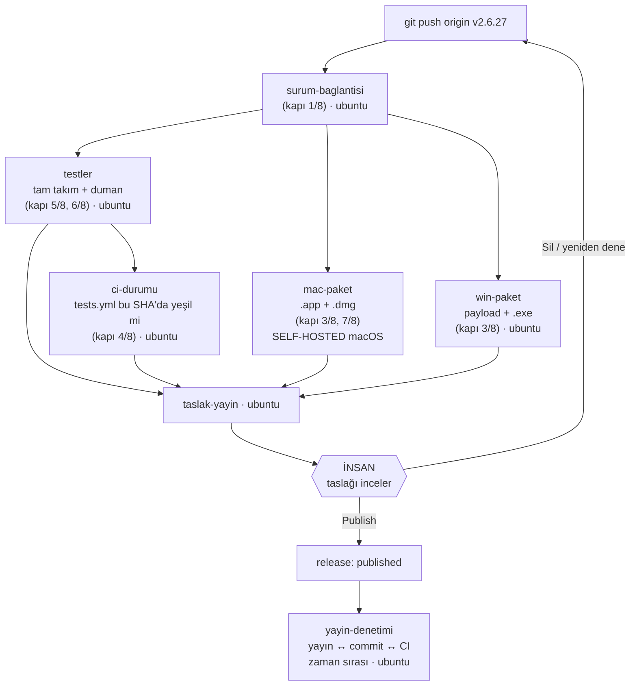

# Yayın otomasyonu — etiketten taslak sürüme

`.github/workflows/release.yml` iş akışının ne yaptığı, neden öyle kurulduğu ve
ilk gerçek koşuda ne beklenmesi gerektiği.

**Tek cümlelik özet:** `v*` etiketi push edilir, runner'lar `.dmg` ve `.exe`
paketlerini *etiketlenen ağaçtan* derler, doğrulamalar koşar, sonuçta **taslak**
bir GitHub sürümü açılır. Taslağı yayına çevirme kararı insandadır.

---

## 1. Neden var

İki ayrı ölçüm bu iş akışını zorunlu kıldı.

**v2.6.25 (2026-07-27).** Kullanıcıya giden ikili, temsil ettiği kaynaktan önce
üretilmişti (GitHub API, UTC):

| Saat | Olay |
|---|---|
| 22:46:25 | DMG + EXE üretildi |
| 23:23:16 | commit `d908ae7` — **ikiliden 36 dk 51 sn sonra** |
| 23:23:50 | CI başladı |
| 23:30:44 | **SÜRÜM YAYINLANDI** — CI hâlâ koşuyordu |
| 23:38:09 | CI yeşil bitti — yayından 7 dk 25 sn sonra |

**v2.6.26 (2026-08-03).** Yayın kapısı artefakt tazeliğini ölçmeye başlayınca
her düzeltme commit'i o ölçümü sıfırladı: `dmg` + `exe` **elle dört kez** yeniden
derlendi. İnsan eli derlediği sürece "bu ikili hangi ağacı temsil ediyor?"
sorusu her commit'te yeniden açılır.

Kök çözüm ikiliyi insanın değil makinenin, etiketlenen ağaçtan üretmesidir.

---

## 2. Akış



`surum-baglantisi` bilerek en başta ve ucuzdur: yanlış etiketlenmiş bir ağaç
için bir saatlik paketleme başlatmanın anlamı yok.

`workflow_dispatch` ile elle tetiklenirse her şey koşar ama `taslak-yayin`
**koşmaz** — dal üstünde çalışan bir koşu var olmayan bir etikete sürüm
açmamalı (`gh release create` eksik etiketi kendisi yaratır).

---

## 3. Neden macOS self-hosted, Windows GitHub'ın runner'ında

Görev iki seçenek istiyordu: girdileri uzaktan çekmek ya da self-hosted runner.
Cevap platform başına farklı çıktı, çünkü **girdilerin doğrulanabilirliği
farklı**. Ölçümler (2026-08-03):

### macOS → self-hosted (zorunlu)

GitHub'ın barındırdığı macOS runner'ında `packaging/build_mac_app.sh` **iki
yerde ölür**:

1. **Satır 159:** `cp -R /opt/anaconda3/lib/python3.12/site-packages/rocketcea "$RES/libs/"`
   — sabit yerel yol, `set -e` altında. rocketcea'nın PyPI'da macOS wheel'i yok
   (betiğin kendi notu bunu söylüyor), yani bu kopya tek kaynak. Runner'da
   `/opt/anaconda3` yoktur → derleme durur.
2. **Satır 127:** `tar -xzf "$B/runtime/pbs-mac.tar.gz"` — bu arşiv
   `.gitignore`'ın 28. satırında (`packaging/runtime/`) ve `git log --all --
   packaging/runtime` **boş** dönüyor: depoda hiç olmamış.

Reddedilen çözüm: runner'da `sudo mkdir -p /opt/anaconda3/...` + `pip install
--target` ile sahte bir Anaconda ağacı kurmak. Teknik olarak mümkün ama o yol
şunu yapardı — sabit yolun *anlamı* "Berke'nin test ettiği ortam"dır; oraya
runner'da derlenen başka bir rocketcea koymak, test edilmemiş bir ikiliyi test
edilmiş gibi paketlemektir. Aynı şekilde pbs-mac.tar.gz yerine "python-build-
standalone'un bir sürümünü indir" demek, arşivde `PYTHON.json` bulunmadığı için
hangi sürüm olduğu **ölçülemeyen** bir runtime'ı sessizce değiştirmek olurdu.

Bu yüzden macOS işi self-hosted runner'da koşar ve arşivi makineden, **sha256
pini doğrulanarak** alır.

### Windows → ubuntu-latest (GitHub'ın runner'ı)

Burada durum tam tersi çıktı:

- `packaging/build_win_payload.sh` zaten **çapraz** çalışıyor:
  `pip install --target --platform win_amd64 --only-binary=:all:` ile Windows
  wheel'lerini indiriyor, hiçbir şey derlemiyor. Bugüne kadar Mac'te koştu;
  Linux'ta aynı iştir.
- Tek yerel girdisi `python-embed-win.zip` idi ve **ölçüldü**:

  ```
  yerel   packaging/runtime/python-embed-win.zip
          sha256 4acbed6dd1c744b0376e3b1cf57ce906f9dc9e95e68824584c8099a63025a3c3
  python.org/ftp/python/3.12.10/python-3.12.10-embed-amd64.zip
          sha256 4acbed6dd1c744b0376e3b1cf57ce906f9dc9e95e68824584c8099a63025a3c3
  ```

  Aynı dosya. "Benzeri" değil, baytı baytına aynısı. Dolayısıyla indirilebilir
  ve doğrulanabilir.
- `makensis` Ubuntu'da paketli. `hrma.nsi` POSIX makensis yolunu zaten ele
  alıyor (`NSIS_WIN32_MAKENSIS` ifdef'i). Ölçüldü (makensis 3.12): göreli `File`
  yolları betiğin **kendi dizinine** göre çözülüyor — hem depo kökünden hem
  `packaging/` içinden çağrıldığında birebir aynı çıktı. `hrma.nsi`'deki
  `win/payload/...` yolları bu yüzden çalışır.

### Girdi pinleri

Her iki girdinin sha256'sı `release.yml`'in `env` bölümünde pinlidir. Girdi
değişirse iş **kırmızı olur** ve pin'in bilinçli güncellenmesini bekler. Sessiz
runtime kayması böyle engellenir; hata mesajı ne yapılacağını söyler.

### `restore_build_inputs.sh` bu sorunu çözmez

Ölçüldü: temiz bir checkout'ta betik iki uyarı basıp `0` ile çıkar. Girdileri
makineden **getirmez**; yaptığı iş yalnız yerel symlink'leri gerçek dizine
çevirmektir. Yine de her iki derleme işinde koşuyor, çünkü self-hosted runner'ın
çalışma dizini kalıcıdır ve elle symlink bırakılmış bir durumda kırık bağlantılı
paket üretmeyi engelleyen tek şey odur.

---

## 4. Yayın kapısından ne koşuyor, ne koşmuyor

`packaging/release_gate.sh` **olduğu gibi** bir runner'da koşamaz. Sessiz atlama
yasak olduğu için hangi adımın neden koşmadığı hem iş kaydına, hem iş özetine,
hem de **taslağın gövdesine** yazılır.

| Kapı adımı | Runner'da | Nerede / neden |
|---|---|---|
| 1/8 sürüm dizgileri | **koşuyor** | `surum-baglantisi` — etiket ↔ `__init__` ↔ changelog ↔ sürüm notu ↔ README |
| 2/8 git durumu | **koşmuyor** | Etiket üstünde ayrık HEAD; `git rev-parse '@{u}'` üst akış dalı bulamaz. Yerine **etiket SHA ↔ derlenen ağacın SHA'sı** karşılaştırılır (3/8 içinde) |
| 3/8 köken kaydı | **koşuyor** | `BUILD_INFO.sha == etiket SHA`, `tree_dirty == false`, sürüm eşleşmesi. macOS'ta **DMG'nin içinden** okunur; Windows'ta payload ağacından (exe'nin içi açılamıyor — kapının kendi kapsam beyanı) |
| 4/8 CI durumu | **koşuyor (uyarlanmış)** | Kapının harfi harfine hâli kendini kilitlerdi: bu koşunun kendisi "tamamlanmamış" görünür. Onun yerine `ci-durumu` işi `tests` iş akışının bu SHA'daki sonucunu ölçer |
| 5/8 tam test takımı | **koşuyor** | `testler` — node ve PyYAML varlığı da doğrulanır (yoksa 30 dosyalık ön yüz bekçisi sessizce atlanırdı) |
| 6/8 canlı duman testi | **koşuyor** | 8087 portunda gerçek sunucu, üç motor türü, `Origin` başlığıyla. 403 ve ölü sunucu yollarının kırmızı verdiği ölçüldü |
| 7/8 macOS imzası | **koşuyor** | `codesign --verify --deep`; DMG içeriği için `ditto --noextattr` + `--deep --strict` |
| 8/8 paket içerik denetimi | **yok** | `release_gate.sh` başlığı böyle bir adım anlatıyor ama betikte **yok** (başlıklar 1/8…7/8'de bitiyor). Yerine ölçülen içerik manifesti basılır: paket boyutu, `Resources` kökü, örnek proje sayısı (depo ile karşılaştırmalı) |

`ci-durumu` neden gerekli: STEP/CAD kolunun 47 bekçisi (build123d) yalnız
`tests.yml`'in `step-export` işinde koşar; bu iş akışının kendi takımı onları
atlar. `tests` bu SHA'da hiç koşmamışsa, hâlâ koşuyorsa ya da kırmızıysa iş
**durur** — etiket, main'e push edilip CI'ı yeşil bitmiş bir commit'e atılmalıdır.

---

## 5. İnsan onay noktası

İş akışı **yayınlamaz**. `packaging/publish_release.sh` şu şekilde çağrılır:

```
TASLAK=1 KAPIYI_ATLA=1 KAPIYI_ATLA_GEREKCE="<koşan ve koşmayan adımlar>" \
    bash packaging/publish_release.sh
```

- **Taslak GitHub'da görünmez** ve `hrma/utils/update_checker.py` taslakları
  okumaz → hiçbir kullanıcının makinesine inmez.
- `KAPIYI_ATLA` betiğin kendi kuralı gereği **yalnız taslakta** çalışır; herkese
  açık sürüm bu yoldan üretilemez.
- Gerekçe en az 20 karakter olmak zorunda ve **taslağın gövdesinin en başına**
  yazılır. Yani "Publish" düğmesine basacak kişi, betiği hiç çalıştırmasa bile
  neyin koşup neyin koşmadığını orada görür.

**Yayına çevirmeden önce yapılacak (insan):**

1. Taslağın gövdesindeki kapı beyanını oku.
2. Artefaktları indir ve en az birini gerçekten kur/aç. Otomasyon paketin
   *üretildiğini* ve *imzalı* olduğunu kanıtlar; **kullanıcı deneyimini
   kanıtlamaz**.
3. GitHub arayüzünden "Publish release".
4. Yayın anında `yayin-denetimi` işi tetiklenir ve zaman sırasını GitHub'ın
   kendi kayıtlarından yeniden ölçer. Kırmızıysa sürüm sayfasında görünür.

Yeniden koşu (re-run) güvenlidir: etiket için **taslak** varsa artefaktlar
`--clobber` ile tazelenir; **yayınlanmış** bir sürüm varsa iş durur ve ona
dokunmaz.

---

## 6. Runner kurulumu (bir kereliktir)

macOS işi `[self-hosted, macOS, ARM64]` etiketli bir runner ister.

1. GitHub → Settings → Actions → Runners → *New self-hosted runner* → macOS /
   ARM64. Kurulumu Berke'nin Mac'inde tamamla.
2. Derleme girdisini runner'ın erişebileceği yere koy:

   ```bash
   mkdir -p ~/.hrma-build-cache/runtime
   cp /Users/apple/HRMA/packaging/runtime/pbs-mac.tar.gz ~/.hrma-build-cache/runtime/
   ```

   Başka bir dizin kullanmak istersen depo değişkeni `HRMA_BUILD_INPUTS`'u ayarla.
3. Makinede bulunması gerekenler (hepsi mevcut olarak ölçüldü):
   `clang`, `codesign`, `hdiutil`, `ditto`, `rsync` ve
   `/opt/anaconda3/lib/python3.12/site-packages/rocketcea`.

**Güvenlik:** depo herkese açık, self-hosted runner ise Berke'nin kendi
makinesi. İş akışında `pull_request` tetikleyicisi **bilerek yoktur** — fork'tan
gelen bir PR bu runner'da kod çalıştıramaz. Etiket push'u yalnız yazma yetkisi
olanın yapabileceği bir eylemdir. Bu tetikleyici asla eklenmemeli.

**Runner çevrimdışıysa** `mac-paket` işi kuyrukta bekler (GitHub 24 saat sonra
iptal eder). Sessiz bir "yeşil" oluşmaz: `taslak-yayin` o işe bağlı olduğu için
taslak da açılmaz.

Her koşuda `actions/checkout` `git clean -ffdx` çalıştırır, yani
`packaging/mac`, `packaging/win`, `packaging/runtime` ve `dist` silinir ve her
derleme sıfırdan yapılır. Bilinçli: "eski `libs` önbelleğinden gelen paket" tam
olarak kaçındığımız şey.

---

## 7. İlk gerçek koşuda beklenenler

Tetikleme:

```bash
# ÖNCE: commit main'de olmalı ve tests.yml onun için yeşil bitmiş olmalı.
git tag v2.6.27
git push origin v2.6.27
```

Beklenen sıra ve kaba süreler:

| # | İş | Süre | Ne görülmeli |
|---|---|---|---|
| 1 | `surum-baglantisi` | ~1 dk | `GECTI surum beyanlari tutarli` |
| 2 | `testler` | 30-60 dk | pytest özeti + atlama envanteri + üç motorun `200` verdiği duman çıktısı |
| 3 | `mac-paket` | 20-40 dk | `GEÇTİ pbs-mac.tar.gz özeti pin ile aynı` → derleme → `GEÇTİ DMG kökeni kanıtlı` → imza + sıkı doğrulama → içerik manifesti |
| 4 | `win-paket` | 60-150 dk | makensis probu → `GEÇTİ gömülü Python … BAYT BAYT aynı` → payload → `GEÇTİ payload kökeni kanıtlı` → exe |
| 5 | `ci-durumu` | ~1 dk | `GEÇTİ 'tests' iş akışı bu SHA'da yeşil` |
| 6 | `taslak-yayin` | ~5 dk | `Yayın türü: TASLAK (--draft)` + iş özeti tablosu |

`win-paket` en uzun iştir: NSIS `/SOLID lzma`, 1,2 GB payload üstünde tek
iş parçacığıyla çalışır (`timeout-minutes: 180`).

**İlk koşuda en muhtemel duraklar:**

- `mac-paket`, "derleme girdisi yok" der → Bölüm 6, adım 2 yapılmamıştır.
- `mac-paket` kuyrukta bekler → runner çevrimdışı.
- `ci-durumu` "tests hiç koşmamış" der → etiket, main'e push edilmemiş bir
  commit'e atılmıştır.
- `win-paket` makensis probunda düşer → apt'ten gelen NSIS bu depodaki
  kalıpları desteklemiyordur; kayıt hangi satırda düştüğünü basar. (Probun
  amacı tam olarak budur: bir saatlik payload derlemesinden **önce** kırılmak.)

---

## 8. Bilinen sınırlar

- **Ayna kod, tek kaynak değil.** Kapının 1/8, 3/8, 6/8, 7/8 adımları
  `release.yml` içinde yeniden yazıldı; `release_gate.sh` adım seçmeye izin
  veren bir bayrak sunmuyor. İkisi zamanla ayrışabilir. Kalıcı çözüm kapıya
  granüler bayrak (ör. `YALNIZ=1,3,6`) eklemektir — o dosya bu çalışmanın
  kapsamı dışındaydı.
- **Windows exe'nin içi denetlenmiyor.** Doğrulanan şey exe'nin üretildiği
  ağaçtır; kapının kendi kapsam beyanının aynısı.
- **İmza ad-hoc.** Apple Developer ID imzası, notarization ve Authenticode
  kapsam dışı. Kullanıcı ilk açılışta Gatekeeper uyarısı görmeye devam eder.
- **Artefaktlar yeniden üretilebilir değil (bit-for-bit).** Aynı ağaçtan iki
  koşu farklı baytlar üretir (zaman damgaları, `__pycache__`, sıkıştırma).
  Ölçülen şey artefaktın *hangi ağaçtan* doğduğu (`BUILD_INFO.sha`), aynı
  baytları verdiği değil.
- **`packaging/release_gate_bypass.log`** runner'da yazılır ve koşuyla birlikte
  kaybolur. Kalıcı kayıt taslağın gövdesindedir.
