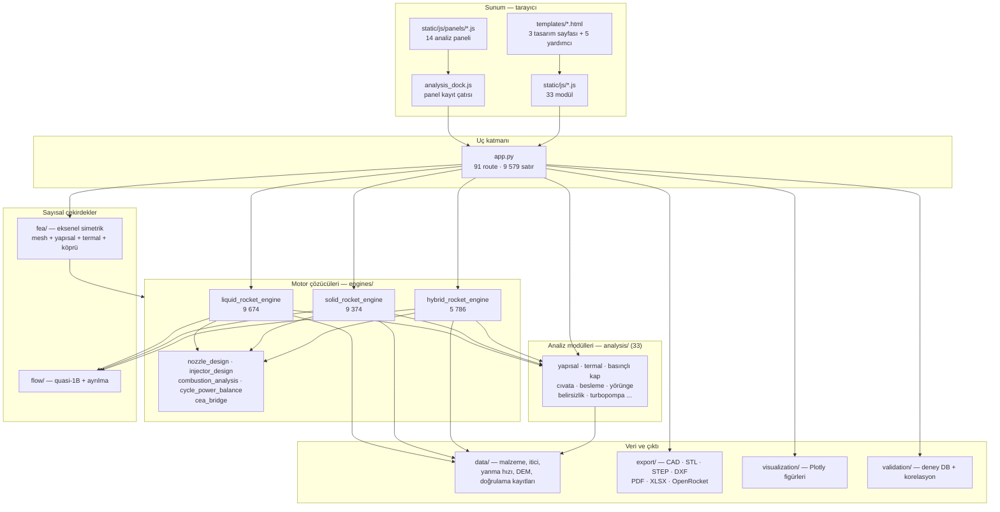

# HRMA sistem haritası — katmanlar, modüller, ölçülmüş büyüklükler

**Son güncelleme:** 2026-08-14
**Kapsam:** Deponun fiziksel yapısı: hangi dizin neyden sorumlu, hangi katman
hangi katmanı çağırır, her parçanın ölçülmüş büyüklüğü. Bir isteğin bu
katmanlar arasındaki yolculuğu ayrı belgededir → [veri-akisi.md](veri-akisi.md).

**Ölçüm tabanı:** `2e2375d` (2.6.27 dokuzuncu parti) + işlenmemiş çalışma
ağacı, 14 Ağustos 2026. Bu belgedeki her sayı `wc -l`, `grep -c` veya
`find | wc -l` ile ölçüldü; hiçbiri tahmin değildir. Ölçüm komutları
bölüm başlarında verilmiştir.

---

## 1. Bir bakışta

HRMA, üç roket motoru tipini (hibrit / katı / sıvı) tek bir masaüstü web
uygulamasında tasarlayan, hesaplayan, analiz eden ve CAD'e döken bir Flask
uygulamasıdır. Sunucu ve istemci aynı makinede koşar; uygulama çevrimdışı
çalışacak biçimde kurulmuştur.

```bash
find hrma -name "*.py" -not -path "*__pycache__*" | wc -l   # 108
find hrma -name "*.py" -not -path "*__pycache__*" -exec cat {} + | wc -l  # 104 836
```

| Katman | Konum | Dosya | Satır |
|---|---|---:|---:|
| Sunum (şablon) | `hrma/templates/` | 8 | 22 306 |
| Sunum (istemci betiği) | `hrma/static/js/` | 33 + 14 panel | 36 729 |
| Sunum (biçem) | `hrma/static/css/` | 4 | 1 371 |
| Uç katmanı | `hrma/app.py` | 1 | 9 579 |
| Motor çözücüleri | `hrma/engines/` | 9 | 32 127 |
| Analiz modülleri | `hrma/analysis/` | 33 | 26 472 |
| Sayısal çözücüler (FEA) | `hrma/fea/` | 5 | 3 076 |
| Akış çekirdekleri | `hrma/flow/` | 3 | 1 102 |
| Veri katmanı | `hrma/data/` | 12 | 6 107 |
| Görselleştirme | `hrma/visualization/` | 3 | 5 649 |
| Dışa aktarım | `hrma/export/` | 10 | 8 759 |
| İçe aktarım | `hrma/importers/` | 6 | 2 470 |
| Doğrulama | `hrma/validation/` | 10 | 4 370 |
| Yardımcılar | `hrma/utils/` | 11 | 4 398 |
| Ortak sabitler | `hrma/constants.py` | 1 | 206 |
| **Test paketi** | `tests/` | 219 | 85 788 |

Test paketinde `pytest --collect-only` ile **6 503 test** toplanıyor
(32,7 sn, 14 Ağustos ölçümü).

---

## 2. Katman diyagramı



**Yön kuralı:** oklar tek yönlüdür. Analiz modülleri motor sınıflarını
tanımaz; motor sözlüğünün alan adlarını bilen tek katman uç katmanı ile
`hrma/fea/bridge.py` köprüsüdür. Ayrıntı → [modul-sozlesmeleri.md](modul-sozlesmeleri.md).

---

## 3. Uç katmanı — `hrma/app.py`

```bash
grep -c "@app.route" hrma/app.py    # 91
wc -l hrma/app.py                    # 9 579
```

Tek dosyada 91 route. İşlev grupları:

| Grup | Örnek uçlar | Adet |
|---|---|---:|
| Sayfa sunumu | `/`, `/hybrid`, `/solid`, `/liquid`, `/formulas`, `/launch-site` | 7 |
| Ana hesap | `/calculate` (hibrit), `/calculate_solid`, `/calculate_liquid` | 3 |
| Analiz uçları | `/api/thermal-protection`, `/api/bolted-joint`, `/api/regen-cooling`, `/api/slosh-analysis`, `/api/water-hammer`, `/api/pressurant-sizing`, `/api/pressure-vessel-analysis`, `/analyze_safety`, `/analyze_structural_safety`, `/analyze_thermal_safety` | ~20 |
| FEA | `/api/fea/structural`, `/api/fea/thermal` | 2 |
| Dışa aktarım | `/api/export-step`, `/api/export-stl`, `/api/export-dxf`, `/api/export-pdf/<report_type>`, `/api/export-xlsx`, `/api/export-openrocket`, `/api/generate-complete-package` | ~15 |
| Veri/katalog | `/api/materials`, `/api/propellants`, `/api/chemical-database`, `/api/burn-rate/resolve`, `/api/oxidizer-properties` | ~10 |
| Uçuş ve saha | `/api/six-dof-analysis`, `/api/trajectory-analysis`, `/api/flight-vehicle`, `/api/launch-site/resolve`, `/api/tile/<layer_key>/<z>/<x>/<y>` | 6 |
| Doğrulama / belirsizlik | `/api/uncertainty-analysis`, `/api/correlation-report`, `/api/validation/upload-csv` | 3 |
| Uygulama kabuğu | `/api/update/*`, `/api/changelog`, `/api/user-guide/*`, `/api/jobs/<job_id>` | ~10 |

**Uç katmanının çapraz kesen görevleri** (route'ların hepsini ilgilendirir):

| İşlev | Yer | Ne yapar |
|---|---|---|
| `_request_trace_id` | `app.py:450` | İstek başına korelasyon kimliği; log satırına yalnız kimlik + alan sayısı yazılır, gövde yazılmaz |
| `_reject_cross_origin` | `app.py:514` | Yerel uygulamaya dışarıdan istek reddi |
| `_reject_malformed_json_body` | `app.py:597` | Bozuk gövdeyi route'a hiç sokmaz |
| `_add_security_headers` | `app.py:782` | Yanıt başlıkları |
| `sanitize_json_values` | `app.py:822` | NaN/Inf → JSON'da geçerli karşılık |
| `validate_input_range` | `app.py:912` | Fiziksel aralık kapısı |
| `EngineContractViolation` + `_require_dict_result` | `app.py:3119`, `app.py:3132` | Motor sözlük döndürmezse HTTP 200 + `null` yerine 500 |
| `_declare_overridden_inputs` | `app.py:1245` | Kullanıcının ezdiği alanların beyanı |
| `job_runner` | `hrma/utils/job_runner.py` | Uzun analizler için iş parçacığı kuyruğu (`/api/jobs/<id>` ile yoklanır) |

---

## 4. Motor çözücüleri — `hrma/engines/`

```bash
wc -l hrma/engines/*.py
```

| Dosya | Satır | Sorumluluk |
|---|---:|---|
| `liquid_rocket_engine.py` | 9 674 | Sıvı motor: çevrim güç dengesi, besleme, rejeneratif soğutma, turbopompa, vana/hat |
| `solid_rocket_engine.py` | 9 374 | Katı motor: tane geometrisi, yanma hızı yasası, basınç sabit-nokta çözücüsü, kasa |
| `hybrid_rocket_engine.py` | 5 786 | Hibrit motor: regresyon (Marxman), blowdown, O/F kayması, port akısı |
| `combustion_analysis.py` | 2 190 | Denge termokimyası (Cantera) — üç motorun ortak yanma çekirdeği |
| `injector_design.py` | 1 918 | Enjektör: NHNE iki-fazlı akış, delik deseni, çarpışma |
| `cycle_power_balance.py` | 1 390 | Sıvı çevrim tipleri (GG / staged / FFSC / expander) güç dengesi |
| `nozzle_design.py` | 1 163 | Rao/konik/bell kontur, `sample_nozzle_inner_contour` — tüm CAD ve FEA'nın tek kontur kaynağı |
| `cea_bridge.py` | 621 | NASA CEA (`rocketcea`) köprüsü |

**Giriş noktaları:** `HybridRocketEngine.calculate()`
(`hybrid_rocket_engine.py:1353`), `SolidRocketEngine.calculate_performance()`
(`solid_rocket_engine.py:8513`), `LiquidRocketEngine.calculate_performance()`
(`liquid_rocket_engine.py:4785`). Üçü de tek bir sözlük döndürür; ölçülen
katı yanıtı **62 üst düzey anahtar** taşır (§ [veri-akisi.md](veri-akisi.md)).

---

## 5. Analiz modülleri — `hrma/analysis/`

33 dosya, 26 472 satır. Bu katman motor sınıflarından bağımsızdır: her modül
SI birimli argüman alır, beyanlı sözlük döndürür.

| Modül | Satır | Konu |
|---|---:|---|
| `trajectory_analysis.py` | 1 882 | Uçuş yolu (3-DOF) |
| `structural_analysis.py` | 1 771 | Lamé, von Mises, MMPDS deratingi, SP-8007 burkulma |
| `heat_transfer_analysis.py` | 1 759 | Bartz, geri kazanım sıcaklığı, Leckner ışıma |
| `regen_cooling.py` | 1 617 | Rejeneratif soğutma, kanal geometrisi |
| `safety_analysis.py` | 1 561 | Emniyet katsayıları, risk matrisi |
| `valve_feedline.py` | 1 260 | Vana Cv, hat basınç bütçesi (C2) |
| `six_dof_trajectory.py` | 1 192 | 6-DOF katı cisim, Barrowman |
| `kinetic_analysis.py` | 1 054 | *(emekli — § teknik-borc)* |
| `thermal_protection.py` | 1 057 | Ablasyon (Q\*), 1B geçici heat-sink, ışıma dengesi. *(Ölçüm anında aktif düzenlemede; `2e2375d`'de 675 satırdı.)* |
| `uncertainty.py` | 881 | LHS Monte Carlo, tornado duyarlılığı |
| `turbopump_sizing.py` | 824 | NPSH → Nss → N → Ns → çark/indüser/türbin (C1) |
| `gimbal_mount.py` | 742 | İtki vektör kontrolü montaj yükleri (C3) — **hiçbir yere bağlı değil** |
| `pressure_vessel.py`, `bolted_joint.py`, `slosh_analysis.py`, `water_hammer.py`, `pressurant_sizing.py`, `tank_blowdown.py`, `transient_ballistics.py`, `acoustic_modes.py`, `two_phase_loss.py`, `igniter_sizing.py`, `nozzle_flow_1d.py`, `kinetic_efficiency.py`, `launch_site.py`, `flight_vehicle.py`, `regression_analysis.py`, `safety_limits.py`, `curve_sampling.py`, `tile_cache.py`, `uq_adapters.py`, `cfd_analysis.py` | — | ilgili alt sistemler |

### 5.1 Bağlama matrisi (ölçüldü, 14 Ağustos 2026)

```bash
grep -c "analysis\.<modül>\b" hrma/engines/<tip>_rocket_engine.py hrma/app.py
```

Sayılar **kaç ayrı yerde çağrıldığını** gösterir; `0` "bağlı değil" demektir.

| Modül | Sıvı | Hibrit | Katı | app.py |
|---|:-:|:-:|:-:|:-:|
| `acoustic_modes` | — | 2 | 3 | — |
| `bolted_joint` | 2 | 2 | 2 | 1 |
| `curve_sampling` | — | 1 | 3 | — |
| `heat_transfer_analysis` | — | 1 | 4 | 1 |
| `igniter_sizing` | — | 1 | 5 | — |
| `kinetic_efficiency` | 2 | 2 | — | 1 |
| `launch_site` | — | 2 | — | 1 |
| `pressurant_sizing` | 2 | — | — | 2 |
| `pressure_vessel` | 3 | 1 | 2 | 1 |
| `regen_cooling` | 3 | — | — | 2 |
| `regression_analysis` | — | 1 | — | 1 |
| `slosh_analysis` | 4 | 2 | — | 2 |
| `structural_analysis` | — | 1 | — | 1 |
| `thermal_protection` | 2 | 2 | 2 | 1 |
| `transient_ballistics` | — | 2 | 3 | 1 |
| `turbopump_sizing` | 2 | — | — | — |
| `two_phase_loss` | — | — | 3 | — |
| `valve_feedline` | 2 | — | — | — |
| `water_hammer` | 8 | — | — | 2 |
| `uncertainty` / `uq_adapters` | (uç) | (uç) | (uç) | 1 + 2 |
| `gimbal_mount` | **—** | **—** | **—** | **—** |
| `tank_blowdown` | dolaylı | dolaylı | — | — |

**Okuma notları:**

* `tank_blowdown` doğrudan hiçbir motorda geçmez ama `transient_ballistics.py`
  onu `N2OTankBlowdown` olarak içeri alır; hibrit `transient_ballistics`
  üzerinden blowdown fiziğine sahiptir. Yani modül yetim değil, **dolaylı**
  bağlıdır.
* `uncertainty` motor sınıflarından değil, uç katmanından
  (`/api/uncertainty-analysis`) `uq_adapters` fabrikalarıyla sürülür ve
  **üç motor tipini de** kapsar (`make_hybrid_factory`, `make_solid_factory`,
  `make_liquid_factory`).
* `gimbal_mount` **tek gerçek yetim**: `analyze_gimbal_mount` yalnız
  `tests/test_c_kulvari_bilesenler.py` içinden çağrılıyor; ne motor ne route
  ne panel. → [teknik-borc.md](teknik-borc.md)

---

## 6. Sayısal çözücüler

### 6.1 `hrma/fea/` — 2B eksenel simetrik FEA (5 dosya, 3 076 satır)

| Dosya | Satır | İş |
|---|---:|---|
| `mesh_axisym.py` | 278 | (z, r) düzleminde yapısal quad mesh — dış mesh kütüphanesi yok |
| `structural_axisym.py` | 692 | Lineer elastik çözücü + yakınsama ile inceltme (D1) |
| `thermal_axisym.py` | 833 | Geri Euler geçici ısı iletimi, Bartz + ışıma sınır koşulu (D2) |
| `bridge.py` | 1 171 | Motor sonucu → FEA girdisi (D4) |
| `__init__.py` | 102 | Dış yüz |

`bridge.py`, mimari açıdan deponun en açık sözleşme belgesidir: motor
sözlüğünün alan adlarını, birimlerini ve beyan zincirini bilen **tek**
katmandır; çözücülerin kendisi motor sözlüğünü hiç tanımaz.

### 6.2 `hrma/flow/` (3 dosya, 1 102 satır)

`quasi1d.py` (sıkıştırılabilir yarı-1B lüle akışı) ve `separation.py`
(Summerfield ayrılma ölçütü). Hem katı hem hibrit motorda bağlıdır; her
ikisi de kendi `*_NOT_MODELLED` sözlüğünü yayımlar.

---

## 7. Veri katmanı — `hrma/data/`

| Dosya | İş |
|---|---|
| `materials_db.py` | Mekanik + termal malzeme kaydı — **tek doğruluk kaynağı** (`get_material`, `get_material_safe`) |
| `propellant_database.py`, `propellants_db.py`, `open_source_propellant_api.py`, `web_propellant_api.py` | İtici katalogları ve çevrimiçi kaynak köprüleri |
| `burn_rate_db.py` | Saint-Robert `a`/`n` rejim tabloları (Nakka 1999/2001 fitleri) |
| `chemical_database.py` | Kimyasal tür verisi |
| `nasa_realtime_validator.py` | NASA referans karşılaştırması |
| `offline_store.py` | Çevrimdışı önbellek |
| `database_integrations.py` | Kaynak yöneticisi |
| `dem/` | ETOPO2022 5' yükseklik verisi (fırlatma sahası küresi) |
| `validation_records/` | Git izlemeli JSON deney kayıtları (hibrit / katı / sıvı) + `SCHEMA.md` |

Sabitler `hrma/constants.py` içinde toplanır (`G_0`, `R_UNIVERSAL`, ISA
tabakaları, `LAMBDA_*` lüle verim çarpanları, `PA_PER_BAR`, c\* makul bantları
— 15 tanım). Fiziksel sabitlerin tamamı burada **değildir**; bilinen borç
[teknik-borc.md](teknik-borc.md) § 2'de.

---

## 8. Çıktı katmanları

### 8.1 `hrma/export/` (10 dosya, 8 759 satır)

`cad_visualization.py` (2 866) 3B katı üreticileri; `openrocket_integration.py`
(1 830) `.eng` motor dosyası; `pdf_generator.py` (1 223) rapor;
`drawing_generator.py` imalat çizimi; `step_export.py` (opsiyonel `build123d`);
`motor_geometry.py` motor sonucu → ortak geometri sözlüğü
(`solid_results_to_motor_geometry:301`, `liquid_results_to_motor_geometry:378`);
`export_workspace.py` istek başına yalıtılmış geçici çalışma alanı ve atomik
yazma.

### 8.2 `hrma/visualization/` (3 dosya, 5 649 satır)

`visualization.py` (5 070) Plotly figürlerini üretir (`create_motor_plot`,
`create_performance_plots`, `create_heat_transfer_plots`, kesit çizimleri).
Figürler yanıtın `plots` alanında JSON olarak taşınır.

### 8.3 `hrma/importers/` (6 dosya, 2 470 satır)

`.hrma` proje dosyası, OpenRocket `.ork`, STEP içe aktarma ve bunların HTTP
yüzü (`api.py`, `step_api.py`).

### 8.4 `hrma/validation/` (10 dosya, 4 370 satır)

`experiment_db.py` künyeli deney kayıtları; `record_adapters.py` (995) kayıt →
motor girdisi dönüşümü; `correlation_runner.py` bias/RMS/medyan APE hesabı;
`status_report.py` `VALIDATION_STATUS.md` otomatik bölgesini üretir;
`paper_report.py` makale kalitesinde korelasyon raporu; `user_data_validation.py`
kullanıcının kendi CSV itki eğrisiyle karşılaştırma.

---

## 9. Sunum katmanı

### 9.1 Şablonlar (8 dosya, 22 306 satır)

| Şablon | Satır | Sayfa |
|---|---:|---|
| `liquid.html` | 6 302 | Sıvı motor tasarımı |
| `solid.html` | 5 899 | Katı motor tasarımı |
| `advanced.html` | 5 540 | Hibrit motor tasarımı |
| `formulas.html` | 1 402 | Formül referansı |
| `uzaytek.html` | 1 188 | Kurumsal sayfa |
| `launch_site.html` | 1 025 | 3B dünya / fırlatma sahası |
| `index.html`, `simple.html` | 950 | Giriş ve test |

Üç tasarım sayfası kendi form toplayıcısını taşır:
`advanced.html::getFormData`, `solid.html::collectAllParameters`,
`liquid.html::collectAllParameters`.

### 9.2 İstemci betikleri (47 dosya, 36 729 satır)

| Dosya | Satır | İş |
|---|---:|---|
| `motor_viz3d.js` | 3 606 | Three.js 3B motor görünümü, kaynak renklendirme, CAD kipi |
| `i18n_*.js` (8 dosya) | 10 960 | EN/TR sözlükleri |
| `app.js` | 2 519 | Hibrit sayfa mantığı, rapor dışa aktarımı |
| `sixdof_panel.js` | 1 818 | 6-DOF paneli |
| `analysis_dock.js` | 1 770 | **Panel kayıt çatısı** — `AnalysisDock.register` |
| `launch_site_globe.js` | 1 330 | Dünya küresi + gök küresi |
| `fea_panel.js` | 1 023 | FEA sonucu: kontur, tel kafes, eleman kalitesi, yakınsama |
| `project_bar.js` | 1 031 | `.hrma` proje kaydet/aç |
| diğerleri | — | enjektör, blowdown, ayarlar, hata bildirimi, güncelleme, kılavuz |

### 9.3 Analiz güvertesi — 14 panel

`AnalysisDock.register` çağıran her panel kendini kategoriye kaydeder ve kendi
ucuna kendisi POST eder:

| Panel | Uç |
|---|---|
| `structural_panel` | `/analyze_structural_safety` |
| `thermal_panel` | `/analyze_thermal_safety`, `/api/analysis/wall-profile` |
| `safety_panel` | `/analyze_safety` |
| `vessel_panel` | `/api/pressure-vessel-analysis` |
| `joint_panel` | `/api/bolted-joint` |
| `cooling_panel` | `/api/regen-cooling` |
| `protection_panel` | `/api/thermal-protection` |
| `feed_panel` | `/api/pressurant-sizing`, `/api/slosh-analysis`, `/api/water-hammer` |
| `flow_panel` | `/api/flow-analysis`, `/api/kinetic-efficiency` |
| `performance_panel` | `/api/advanced-performance-analysis` |
| `comparative_panel` | `/api/comparative-analysis` |
| `uncertainty_panel` | `/api/uncertainty-analysis` + `/api/jobs/<id>` |
| `correlation_panel` | `/api/correlation-report` |
| `validation_panel` | `/api/validation/upload-csv` |

Paneller ana hesap sonucundan otomatik dolar ama **bağımsız da çalışır**:
POST gövdesi her zaman panelin kendi formundan toplanır.

---

## 10. Bağımlılıklar

`requirements.txt` (ölçüldü, 14 Ağustos):

| Küme | Paketler | Not |
|---|---|---|
| Web | `flask>=3.0`, `flask-cors`, `gunicorn` (POSIX) / `waitress` (Windows) | |
| Sayısal | `numpy>=1.24,<2`, `scipy>=1.11` | `numpy<2` **pini zorunlu** — anaconda kurulumlarında pandas/sklearn ikili uyumu kırılıyor |
| Termokimya | `cantera>=3.0,<4` | **Opsiyonel değil.** Yoksa `CombustionAnalyzer` sabit bir ürün bileşimine düşüyordu (ölçülen c\* hatası %4,4-13,4) |
| CEA | `rocketcea>=1.2` | Ek doğruluk; macOS'ta PyPI tekerleği yok |
| Termofizik | `CoolProp>=6.5` | NIST RefProp tabanlı |
| Geometri/CAD | `shapely`, `trimesh`, `manifold3d`, `ezdxf` | `build123d` (STEP) **bilerek dışarıda**: metadata `numpy>=2` istiyor, pinle çakışıyor |
| Çizim/rapor | `plotly`, `matplotlib`, `kaleido==0.2.1`, `reportlab`, `Pillow` | kaleido pini: 1.x, `plotly<6.1.1` ile `write_image` üretemiyor |
| Veri | `pandas>=2.0`, `openpyxl`, `lxml` | |
| Ağ | `requests`, `beautifulsoup4`, `aiohttp` | |
| Paketleme | `pyinstaller>=5.13` | |

`requirements.txt` bu projede yalnız liste değil, **karar kaydıdır**: her
pinin gerekçesi ölçümüyle birlikte dosyanın içinde yazılıdır.

---

## 11. Çalıştırma ve paketleme

* Geliştirmede: `hrma/run.py` (POSIX) / `hrma/run_windows.py`, ya da
  `start.sh` / `start.bat`.
* `app.py` doğrudan çalıştırılsa bile depo kökünü `sys.path`'e ekler
  (`app.py:8-10`) — Windows geri dönütünden doğan koruma.
* Paketleme `packaging/` altında; macOS `.app`/DMG **self-hosted** runner'da,
  Windows `.exe` GitHub runner'ında derlenir (`.github/workflows/release.yml`).
  Gerekçeleri iş akışı dosyasında ölçümüyle yazılı.
* `pytest.ini` toplamayı `tests/` ile sınırlar: kök toplama paketlenmiş
  uygulamanın kendi kütüphanelerine iniyor ve imzalı bundle'ın mührünü
  bozuyordu.

---

## 12. Ölçüm nasıl tekrarlanır

```bash
# Büyüklükler
find hrma -name "*.py" -not -path "*__pycache__*" | wc -l
find hrma -name "*.py" -not -path "*__pycache__*" -exec wc -l {} + | sort -rn | head -20

# Uçlar
grep -n "@app.route" hrma/app.py

# Bağlama matrisi
# DİKKAT: bu desen yalnız `from hrma.analysis.X import ...` biçimini sayar.
# `from hrma.analysis import X` biçimiyle bağlanan modüller (flight_vehicle,
# tile_cache, uq_adapters) burada 0 görünür ama YETİM DEĞİLDİR. Yetim taraması
# için docs/mimari/teknik-borc.md § 13'teki iki-biçimli sürümü kullanın.
for m in $(ls hrma/analysis/*.py | xargs -n1 basename | sed 's/.py//'); do
  printf "%-24s %s %s %s %s\n" "$m" \
    $(grep -c "analysis\.$m\b" hrma/engines/liquid_rocket_engine.py) \
    $(grep -c "analysis\.$m\b" hrma/engines/hybrid_rocket_engine.py) \
    $(grep -c "analysis\.$m\b" hrma/engines/solid_rocket_engine.py) \
    $(grep -c "analysis\.$m\b" hrma/app.py)
done

# Beyan yoğunluğu
grep -rn "NOT_MODELLED" hrma/ --include='*.py' | grep -v __pycache__ | wc -l

# Canlı bağlama haritası (ölçerek üretir, dakikalar sürer)
python3 tools/wiring_map.py --page solid
```
