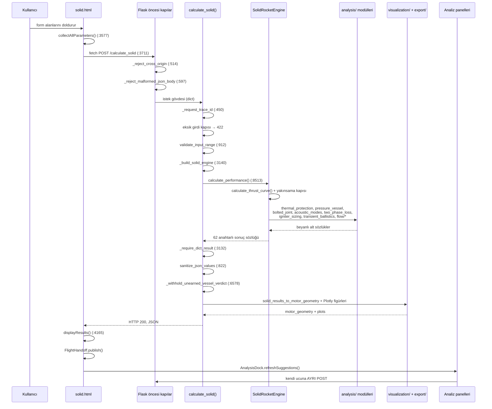

# Veri akışı — bir isteğin uçtan uca yolculuğu

**Son güncelleme:** 2026-08-14
**Kapsam:** Kullanıcının form alanına yazdığı sayının motor parametresine,
oradan ekrandaki çıktıya kadar izlediği yol. Örnek olarak `/calculate_solid`
uçtan uca izlenmiştir; hibrit ve sıvı farkları § 8'de. Katmanların ne olduğu
[sistem-haritasi.md](sistem-haritasi.md)'de.

**Ölçüm tabanı:** `2e2375d`, 14 Ağustos 2026. Yanıt yapısı canlı ölçüldü
(`app.test_client()` ile gerçek bir `POST /calculate_solid`), kod referansları
`dosya:satır` biçiminde verilmiştir.

---

## 1. Neden bu belge var

Bu kod tabanındaki ciddi kusurların büyük bölümü aynı sınıftandır: **iki
parça tek başına doğru, aralarındaki sözleşme yanlış.** Alan adı katmanlar
arasında değişir (`pressure_drop_percent` yüzde toplanıp `pressure_drop`
olarak bar gider), birim değişir (mm ↔ m), ya da alan hiç gönderilmez.
Zincirin tamamını bir yerde görmek, bu sınıfı aramanın ön koşuludur.

Deponun bu zinciri **ölçen** kendi araçları da vardır (§ 7) — bu belge onların
ürettiği resmin insan tarafından okunan hâlidir.

---

## 2. Zincirin tamamı



---

## 3. Adım adım — `/calculate_solid`

### 3.1 Form → yük (payload)

**`hrma/templates/solid.html:3577` `collectAllParameters()`**

Sayfadaki her form alanı `document.getElementById(...).value` ile okunur ve
düz bir JSON nesnesine konur. Alan adı ile yük anahtarı çoğunlukla aynıdır
(`chamber_diameter`, `grain_length`, `core_diameter`, `chamber_pressure`,
`burn_rate_a`, `burn_rate_n`, `grain_type`, `propellant_name`, ...).

Bu fonksiyon aynı zamanda **varsayılan enjekte eden yerdir**:

```js
chamber_pressure: parseFloat(...value) || 40,
burn_rate_a:      parseFloat(...value) || 0.005,
```

Bu kalıbın bilinen bir kusuru vardır ve `burn_rate_n` için özel olarak
düzeltilmiştir (KN-şeker plateau rejiminde `n` negatif olabilir; `|| 0.35`
kalıbı 0 girdisini ezerdi, yerine `isNaN` denetimi kondu). Aynı kalıbın
`burn_rate_a` için hâlâ açık olan sonucu → [teknik-borc.md](teknik-borc.md) § 1.

**`solid.html:3705` `calculateSolid()`** → `fetch('/calculate_solid', {method:'POST', ...})`
(`:3711`).

### 3.2 İstek öncesi kapılar

| Kapı | Yer | Reddettiği |
|---|---|---|
| `_reject_cross_origin` | `app.py:514` | Yerel uygulamaya dışarıdan gelen istek |
| `_reject_malformed_json_body` | `app.py:597` | Bozuk/uygunsuz gövde — route hiç görmez |

### 3.3 Uç: `calculate_solid()` — `app.py:3234`

**a) İz kimliği.** `_request_trace_id()` (`:450`). Loga yalnız kararlı olay
adı + kimlik + **alan sayısı** yazılır; hiçbir alan adı ve hiçbir değer
loglanmaz.

**b) Eksiksizlik kapısı.** Boş gövdeye eksiksiz bir tasarım döndürme kusuru
kapatılmıştır. Kapı iki geçerli girdi kipini de tanır:

| Kip | Zorunlu alanlar |
|---|---|
| Her ikisinde ortak | `chamber_pressure` + yakıt kimliği (`propellant_type` \| `propellant_name` \| `burn_rate_preset`, ya da `burn_rate_a` + `burn_rate_n` çifti) |
| (1) Geometri | `chamber_diameter`, `grain_length`, `core_diameter` |
| (2) Tasarım noktası | `thrust`, `burn_time` |

Karşılanmazsa **HTTP 422** `status: incomplete_input` + eksik alan listesi +
`required_fields` şeması döner. `use_tutorial_defaults: true` gönderilirse
öğretici varsayılanlar uygulanır ama sonuç `defaults_applied` ve
`input_source: 'tutorial_defaults'` alanlarıyla **bunu taşır**.

**c) Aralık doğrulaması.** `validate_input_range` (`app.py:912`) — çap
10-2000 mm, tane boyu 50-5000 mm, çekirdek 5 mm ile (çap − 5 mm) arası,
oda basıncı 5-200 bar, `a` 0,0001-0,1, `n` −0,5 ile 1,0 (alt sınır negatif:
KN-şeker plateau/mesa rejimleri).

**d) Motorun kurulması.** `_build_solid_engine()` (`app.py:3140`). Bu
fonksiyon, yanma hızı katsayılarının **kaynağını beyan eden** sözleşmedir:

| Durum | Motora geçen değer | `burn_rate_a_source` |
|---|---|---|
| Alan istekte var | Aynen | `request` |
| Alan yok, yakıt katalogda var | Katalog kaydı | `central_catalog:<yakıt>` |
| Alan yok, yakıt katalogda yok | Kurucu varsayılanı (APCP) | `engine_constructor_default:apcp_catalog` |

Katalog çözümü yakıt kimliği çözüldükten **sonra** yapılır; gerekirse motor
o kimlikle yeniden kurulur (ölçülen kurulum maliyeti 0,09 ms). Bu, motorun
iç durumunu dışarıdan elle değiştirmekten güvenlidir.

### 3.4 Form alanı → motor parametresi köprüsü: `overrides`

Kurucuya yalnız ana geometri argümanları isimle geçirilir; **formun geri
kalanı** `overrides=data` olarak bütün hâlinde motora verilir
(`app.py:3184`, `_build_solid_engine` içinde
`motor_kwargs['overrides'] = data`).

Motor tarafında (`solid_rocket_engine.py:894` `self.overrides = dict(...)`)
her alan **tanınıyorsa ve fiziksel aralıktaysa** uygulanır:

```
_override_val(key, lo, hi)   # solid_rocket_engine.py:938
```

Tanınmayan ya da bilinçli olarak kullanılmayan alanlar **sessizce yutulmaz**:
motor `unwired_inputs()` (`solid_rocket_engine.py:1057`) ile bunları
sınıflandırıp yanıta koyar (`results['unwired_inputs']`, `:9211`). Ölçülen
sınıflar:

| Sınıf | Anlamı | Örnek alanlar |
|---|---|---|
| `structural_output` | Girdi değil, motorun kendi hesapladığı çıktı | `case_mass`, `nozzle_mass`, `closure_mass`, `insulation_mass` |
| `test_bench_only` | Test tezgâhı parametresi, fizik girdisi değil | `sampling_freq`, `load_cell_capacity`, `filter_cutoff`, `calibration_factor` |
| `reported_not_double_counted` | Raporlanır ama çift sayılmasın diye uygulanmaz | `overall_efficiency` |
| `overridden_by_regime_table` | Rejim tablosu tarafından ezilir | (bu koşuda boş) |

Sıvı motorda aynı sözleşme `liquid_rocket_engine.py:1326` `unwired_inputs()`
ile kurulur.

### 3.5 Çözücü: `SolidRocketEngine.calculate_performance()` — `solid_rocket_engine.py:8513`

1. `calculate_thrust_curve()` — zaman marşı, her adımda **sönümlü sabit-nokta**
   ile denge oda basıncı (adım başına en çok 100 yineleme).
2. **Yakınsama kapısı.** Çözücü yakınsama durumunu zaten raporluyordu ama
   kimse okumuyordu; kapı iki kademelidir:
   * **1. kademe — sonuç üretilmez:** yakınsama yok **ve** yanma anormal
     bitmiş (`safety_limit` / `throat_eroded_out` / `not_started`), ya da
     yakınsama yok **ve** `n ≥ 1` (daralma savı geçersiz).
   * **2. kademe — sonuç üretilir, etiket düşürülür:** yanma normal bitti,
     `n < 1`, yalnız bazı adımlar yineleme tavanına takıldı.
   `pressure_collapse` ve `burn_rate_zero` **normal** sonlardır: yıldız/finocyl
   tanede yanan alan tükenişte sıfıra düşer, basıncın çökmesi yanmanın doğal
   sonudur.
3. Alt sistemler çağrılır ve her biri **kendi beyanlı bloğunu** sonuç
   sözlüğüne koyar: `_two_phase_loss_report` (`:3895`), `_acoustic_mode_report`
   (`:4048`), `_nozzle_flow_field_report` (`:4196`), `_design_igniter_system`
   (`:5912`, `analysis.igniter_sizing` ile), yapısal/termal/kap analizleri.

### 3.6 Yanıt kapıları

| Kapı | Yer | İş |
|---|---|---|
| `_require_dict_result` | `app.py:3132` | Motor sözlük döndürmediyse `EngineContractViolation` → HTTP **500**. Eskiden `None.setdefault` yutuluyor, log "success" yazıyor, istemciye `null` gidiyordu |
| `sanitize_json_values` | `app.py:822` | NaN/Inf değerleri JSON'da geçerli karşılığa çevirir |
| `burn_rate_inputs` eklenmesi | `app.py:3392` | § 3.3'teki kaynak beyanı yanıta konur |
| `_withhold_unearned_vessel_verdict` | `app.py:6578` | Kullanıcı kasa kalınlığı vermediyse `pressure_safety.vessel_status` **PASS diyemez**: cidarı HRMA'nın kendisi Barlow ile SF'yi sağlayacak şekilde boyutlandırıp sonra aynı cidarı sınamak totolojidir |
| `solid_results_to_motor_geometry` | `hrma/export/motor_geometry.py:301` | Ortak geometri sözlüğü — CAD, 3B görünüm ve FEA aynı kaynaktan beslenir |
| Figür üretimi | `visualization.py` | `plots.motor` (kesit), `plots.performance`. **Dar** `try/except` içindedir: çizim hatası hesabı düşürmez, ama motor sonucunun bozukluğunu da yutmaz |

### 3.7 Ölçülen yanıt

`POST /calculate_solid` (Ø100 mm, tane 500 mm, çekirdek 30 mm, 40 bar, APCP)
→ **HTTP 200, 62 üst düzey anahtar.** Gruplandırılmış hâli:

| Grup | Anahtarlar |
|---|---|
| Skaler performans | `average_thrust`, `max_thrust`, `total_impulse`, `burn_time`, `specific_impulse`, `isp_sea_level`, `isp_vacuum`, `c_star`, `chamber_temperature`, `gamma`, `expansion_ratio(_vacuum)`, `throat_diameter`, `exit_diameter(_vacuum)`, `propellant_mass` |
| Zaman serileri | `thrust_curve` (7 alan), `thrust_curve_separation` (7), `altitude_performance` (8 nokta) |
| Geometri | `grain_design` (18), `motor_geometry` (20), `nozzle_contour` (2), `nozzle_design` (13), `nozzle_angles` (10), `throat_sizing` (11), `cad_design` (9) |
| Fizik blokları | `acoustic_modes` (15), `two_phase_loss` (19), `nozzle_flow_quasi1d` (22), `nozzle_flow_separation` (15), `thermal_analysis` (3), `structural_analysis` (3), `safety_analysis` (4), `nozzle_material_analysis` (9) |
| **Beyan blokları** | `burn_rate_inputs` (5), `burn_rate_basis`, `gamma_basis`, `unwired_inputs` (7), `solver_diagnostics` (10), `design_summary` (8), `design_warnings` (3), `warnings` (3) |
| Diğer | `plots` (2), `detailed_analysis`, `advanced_performance`, `cost_analysis`, `manufacturing_analysis`, `quality_analysis`, `environmental_analysis`, `flight_simulation` |

Ölçülen `solver_diagnostics` örneği (aynı koşu):

```json
{"convergence_achieved": true, "pressure_solver_steps": 486,
 "pressure_solver_failed_steps": 0, "pressure_solver_max_residual": 9.99e-07,
 "pressure_solver_tolerance": 1e-06, "termination_reason": "web_exhausted",
 "burn_rate_exponent": 0.35, "time_step_s": 0.01, "burnout_time_s": 4.86,
 "basis": "Equilibrium chamber pressure is solved with a damped fixed-point ..."}
```

### 3.8 İstemciye dönüş

`solid.html:3705` `calculateSolid()` içinde:

1. `results.error` varsa hata gösterilir (motor sözleşmesi: hata da sözlüktür).
2. `currentResults = results` — sayfa genelinde tek doğruluk kaynağı.
3. `window.FlightHandoff.publish(results, {motor_type:'solid'})` — uçuş/6-DOF
   köprüsü (`static/js/flight_handoff.js:119`).
4. `displayResults(results)` (`solid.html:4165`) — tablolar, rozetler, figürler.
5. `AnalysisDock.refreshSuggestions()` — panellerin form önerileri tazelenir,
   **kullanıcının elle değiştirdiği alanlar ezilmez.**

### 3.9 Paneller — ikinci tur istekler

Analiz panelleri ana yanıtın içinden beslenmez; her biri kendi ucuna **ayrı
bir POST** yapar. Öneri değerleri `currentResults`'tan gelir, ama gövde her
zaman panelin kendi formundan toplanır. Böylece panel ana hesap koşmadan da
çalışır. Panel→uç eşlemesi
[sistem-haritasi.md § 9.3](sistem-haritasi.md#93-analiz-güvertesi--14-panel).

---

## 4. Birim sözleşmesi

Zincirde birim iki kez değişir ve ikisi de belgelidir:

| Sınır | Birim |
|---|---|
| Form alanı → yük | Mühendislik birimi: **mm**, **bar**, **K**, **s** |
| Yük → motor | Uçta dönüştürülür: `_mm_to_m` (`app.py:174`), `_mm_to_m_optional` (`:192`), `_bar_to_pa` (`:2802`) |
| Motor içi | **SI** (m, Pa, K, kg, s). İstisna: üst düzey `chamber_pressure` üç motorda da **bar** taşır |
| Motor → yanıt | Karışık; her alanın birimi adında ya da `_basis`inde yazılıdır (`wall_thickness_mm`, `x_mm`, `burnout_time_s`) |
| Yanıt → FEA köprüsü | `bridge.py` bar→Pa, mm→m dönüşümünü **tek elden** yapar |

Birim körlüğü bu depoda ölçülmüş bir kusur sınıfıdır (geçmişte iki adet
1000× hata yakalandı); bu yüzden yeni alanlar birimi adında taşır.

---

## 5. Beyan zinciri — sayının kaynağı yanıtta durur

Bir sayı yanıtta yalnız başına gitmez; nereden geldiği yanında gider.

| Anahtar | Anlamı |
|---|---|
| `_basis` | Hesabın dayandığı model/formül ve kaynak künyesi (593 satırda geçiyor) |
| `_source` | Değerin geldiği yer: `request`, `central_catalog:<x>`, `materials_db`, ... (510 satır) |
| `_status` | Bloğun hükmü: `OK` / `DEGRADED` / `NOT_MODELLED` (139 satır) |
| `NOT_MODELLED` | Bilinçli olarak modellenmeyenlerin metinli listesi (209 satır) |
| `warnings` / `design_warnings` | i18n kodlu uyarı nesneleri (`code`, `params`, `severity`) |

Uyarılar serbest metin değil, **koda bağlı nesnelerdir**:

```json
{"code": "warn.solid.burn_rate_off_catalog",
 "params": {"propellant": "apcp", "user_rate_mmps": 18.18,
            "catalog_rate_mmps": 8.12, "ratio": 2.24, "pressure_bar": 40.0},
 "severity": "warning"}
```

Metin istemcide sözlükten (`i18n_charts.js`) çözülür; arka uç dil üretmez.

---

## 6. Hata yolu

| Durum | HTTP | Gövde |
|---|---|---|
| Eksik kritik girdi | 422 | `status: incomplete_input`, `missing_fields`, `required_fields`, `hint` |
| Aralık dışı / doğrulama | 400 | `error`, `error_type`, `trace_id` |
| Motor sözleşme ihlali | 500 | aynı gövde, `error_type: EngineContractViolation` |
| Emekli uç | 501 | halef uca yönlendirme alanı |

Yığın izi **yanıta konmaz** (yalnız loga). Kullanıcı destek isterken
`trace_id` verir; log satırı gövdeyi saklamadan olayla eşleşir.

---

## 7. Zinciri ölçen araçlar

Bu belge elle yazıldı ama zincirin kendisi **ölçülebilir**:

| Araç | Ne ölçer |
|---|---|
| `tests/support/inventory.py` (244 satır) | **Katman A:** şablondaki her form alanı toplayıcıda gerçekten okunuyor mu? Yalnız statik metin okur, milisaniye sürer |
| `tests/support/shake.py` (285 satır) | **Katman B:** her yük anahtarı sarsıldığında yanıtın hangi yaprakları değişiyor? |
| `tools/wiring_map.py` | A + B'den tek dosyalık HTML bağlama haritası üretir (`docs/dev/wiring_map.html`). Hibritte ~40 sn, üç sayfa birkaç dakika |

Katman A'nın var oluş sebebi ölçülmüş bir kusurdur: v2.6.25'te hibritin
`chamber_material` / `wall_thickness` / `cooling_channels` alanları için arka
uç doğru yazılmıştı, ama `advanced.html` toplayıcısı o üç alanı **hiç
göndermiyordu**. HTTP katmanını sınayan bir test "bağlandı" derdi; kusur arka
uçta değil, şablon ile yük arasındaki dikişteydi.

Bağlama haritasının dürüstlük kuralı: ölçülemeyen alan "ölü" diye
işaretlenmez, **"ölçülemedi"** diye işaretlenir. İkisi farklı şeydir ve
karıştırmak tam olarak bu araçla kovalanan hata sınıfıdır.

---

## 8. Diğer iki motorun farkları

| | Hibrit | Katı | Sıvı |
|---|---|---|---|
| Sayfa | `advanced.html` | `solid.html` | `liquid.html` |
| Toplayıcı | `getFormData` | `collectAllParameters` | `collectAllParameters` |
| Uç | `/calculate` (`app.py:1327`) | `/calculate_solid` (`:3233`) | `/calculate_liquid` (`:3552`) |
| Motor giriş noktası | `HybridRocketEngine.calculate()` (`:1353`) | `SolidRocketEngine.calculate_performance()` (`:8513`) | `LiquidRocketEngine.calculate_performance()` (`:4785`) |
| Karakteristik zincir | Regresyon → port akısı → blowdown → O/F kayması | Tane geometrisi → yanma hızı yasası → basınç sabit noktası | Çevrim güç dengesi → turbopompa/besleme → rejeneratif soğutma |
| Ortak geometri | `hybrid_results_to_motor_geometry` yolu | `solid_results_to_motor_geometry:301` | `liquid_results_to_motor_geometry:378` |

Üçünde de lüle iç konturu **tek** örnekleyiciden gelir:
`nozzle_design.sample_nozzle_inner_contour`. Origin sözleşmesi: ilk nokta
konverjan girişidir (z = 0, r = kamara yarıçapı), z çıkışa doğru artar. Bekçi:
`tests/test_motor_geometri_yayimi.py`. CAD, 3B görünüm, STL ve FEA bu tek
kaynaktan beslendiği için "ekranda gördüğün geometri ile analiz edilen
geometri" aynıdır.

---

## 9. FEA yolu — ikinci bir akış deseni

FEA istekleri motor hesabını **yeniden koşmaz**; mevcut motor sonucunu girdi
olarak alır:

```
istemci (fea_panel.js)
  → POST /api/fea/structural  (app.py:7265)  |  /api/fea/thermal (:7502)
     → _fea_pick_motor_results (:7188)      motor sonucunu seçer
     → hrma.fea.bridge.run_structural_from_motor / run_thermal_from_motor
        → alan haritası: kontur, cidar kalınlığı, malzeme, iç basınç
        → hrma.fea.mesh_axisym  → structural_axisym / thermal_axisym
     → _fea_quad_quality (:7221)            eleman kalitesi (en-boy, Jacobian)
  ← {status, mesh, alanlar, yakınsama geçmişi, kalite}
```

Köprünün değişmez kuralı: **eksik girdi uydurulmaz.** Kontur bloğu yoksa,
cidar kalınlığı yayımlanmamışsa ya da malzeme kaydında E/ν yoksa sonuç
`BRIDGE_STATUS_NOT_MODELLED` ile reddedilir — varsayılan bir kalınlıkla
renkli kontur üretilmez.

Bilinen sınır, köprünün kendi belgesinde yazılıdır: hiçbir motor sonucu lüle
boyunca P(x) yayımlamadığı için iç yüzeye **sabit** `chamber_pressure`
uygulanır ve bu beyan edilir.
